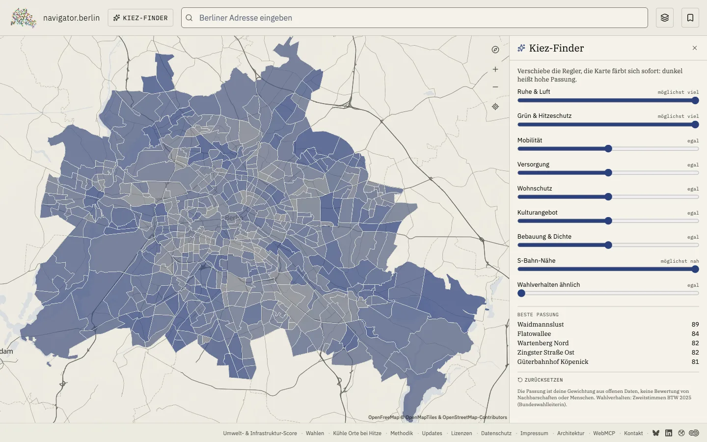
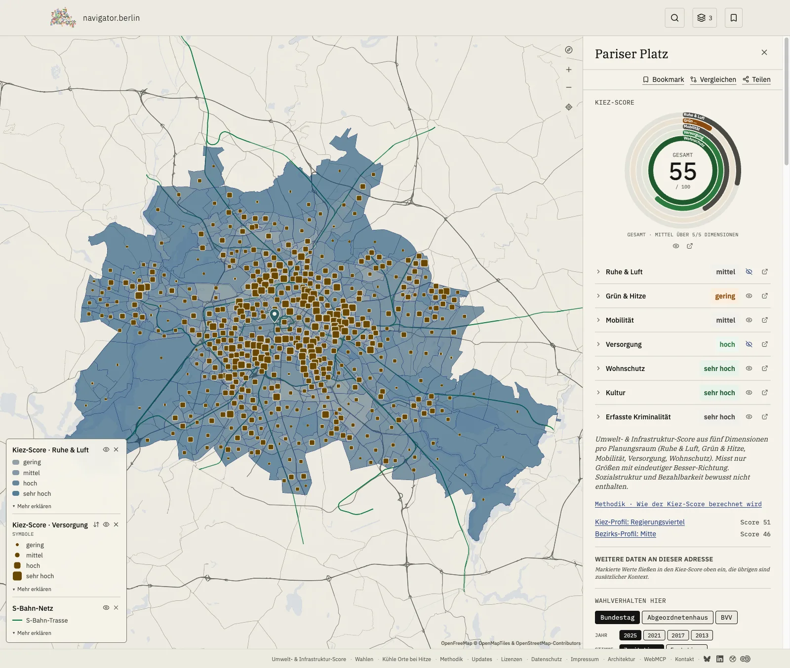

# navigator.berlin

Cross-Layer Berlin Atlas: adressgenaue Multi-Layer-Inspektion (Klima, Lärm, Mobilität, Heritage, demografische Daten) auf einer offenen Karte.

GitHub: <https://github.com/mschmdb/navigator-berlin>





## Setup

```sh
pnpm install
pnpm dev
```

Anforderungen: Node.js ≥20 (siehe `.nvmrc`), pnpm 10.

Die Karte, alle Geo-Layer und der Kiez-Finder laufen ohne weitere Konfiguration: `static/` enthält die fertig generierten Daten.

**Optional: Postgres.** Wahldaten und Zusatzdaten (FAQ, Ranks, Vergleiche) kommen aus einer lokalen Postgres-Datenbank. Ohne `DATABASE_URL` antwortet `/wahl` mit 503; Bezirk- und Kiez-Seiten rendern mit reduzierten Daten. Setup: [`docs/runbooks/local-postgres-setup.md`](./docs/runbooks/local-postgres-setup.md), Variablen: [`.env.example`](./.env.example).

## WebMCP

navigator.berlin registriert 11 Tools über die [WebMCP-API](https://webmachinelearning.github.io/webmcp/) (`window.agent`-`ModelContext`). Browser-Agenten (z.B. ChatGPT in Atlas, Chrome 149 mit WebMCP-Flag) können damit Adressen nachschlagen, Layer an Koordinaten abfragen, Wahlergebnisse vergleichen und den Kiez-Finder steuern: `set_finder_weights` stellt die Regler, die Karte färbt sich live vor den Augen des Menschen um, `get_finder_state` liest zurück, was der Mensch nachjustiert hat.

- Tool-Manifest: [`/webmcp-manifest.json`](https://navigator.berlin/webmcp-manifest.json)
- Doku: [`docs/webmcp-challenge.md`](./docs/webmcp-challenge.md)

## Daten-Pipeline

Alle Layer und Aggregate entstehen aus Build-Scripts (`pnpm data:*`), Quelle-für-Quelle deklariert in `scripts/lib/sources.ts`. Ablauf und Abhängigkeiten: [`docs/data-pipeline.md`](./docs/data-pipeline.md).

## Datenquellen

Offene Daten von ODIS Berlin, Umweltatlas (SenMVKU), Geoportal Berlin/FIS-Broker, OpenStreetMap, Bundeswahlleiterin, Amt für Statistik Berlin-Brandenburg, Polizei Berlin (Kriminalitätsatlas) und DWD Climate Data Center. Alle Lizenzen und Attributionen: [navigator.berlin/lizenzen](https://navigator.berlin/lizenzen).

## Stack

SvelteKit 2 · Svelte 5 (Runes) · TypeScript strict · Tailwind v4 · Paraglide v2 (8 Sprachen) · MapLibre GL · Layerchart · D3 · Turf · Bits UI · WebMCP · Vitest · Playwright.

Volle Architektur-Übersicht: `docs/adr/` (Architectural Decision Records).

## Lizenz

MIT, siehe [`LICENSE`](./LICENSE).
