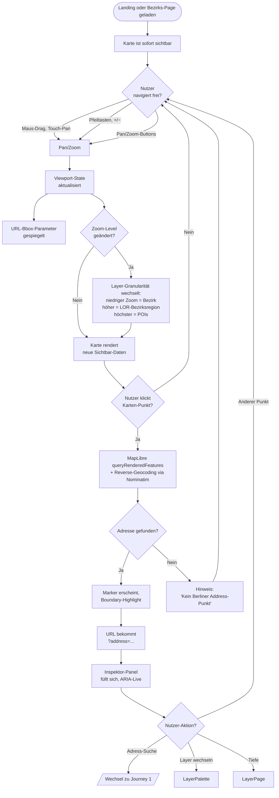
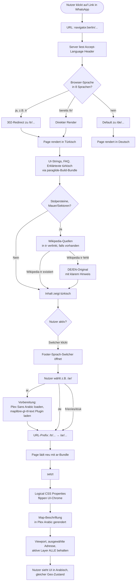
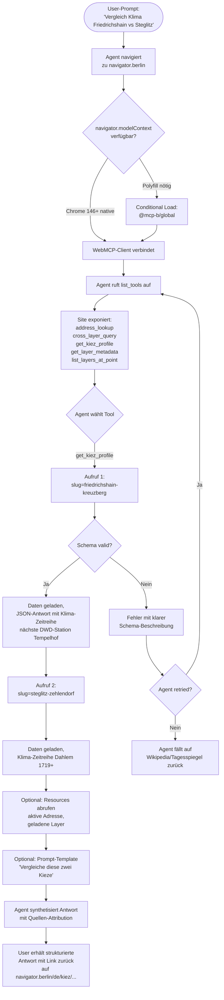

---
stepsCompleted:
  - step-01-init
  - step-02-discovery
  - step-03-core-experience
  - step-04-emotional-response
  - step-05-inspiration
  - step-06-design-system
  - step-07-defining-experience
  - step-08-visual-foundation
  - step-09-design-directions
  - step-10-user-journeys
  - step-11-component-strategy
  - step-12-ux-patterns
  - step-13-responsive-accessibility
  - step-14-complete
status: complete
completedAt: '2026-05-11T18:30:00Z'
lastStep: 14
inputDocuments:
  - _bmad-output/planning-artifacts/prd.md
  - _bmad-output/planning-artifacts/product-brief-navigator.berlin.md
  - _bmad-output/planning-artifacts/product-brief-navigator.berlin-distillate.md
  - _user-input/berlin-atlas-recherche.md
  - _user-input/navigator-berlin-design.md
workflowType: 'ux-design'
projectName: 'navigator.berlin'
documentCounts:
  prd: 1
  brief: 1
  distillate: 1
  research: 1
  designDirective: 1
---

# UX Design Specification — navigator.berlin

**Author:** Matze Schmidbauer
**Date:** 2026-05-11

<!-- UX design content appended sequentially through collaborative workflow steps -->

## Executive Summary

### Project Vision

`navigator.berlin` ist eine ruhige, daten-dichte Civic-Tech-Web-App: jede Berliner Adresse als Eingangstür, ein konsequent gestaltetes Inspektor-Panel mit allen relevanten Stadt-Layern als Antwort. Die UI tritt zurück, damit die Daten Vordergrund werden. Verbindliche Designsprache: IBM Plex (Sans + Serif + Mono) als durchgehende Familie, Off-White-Palette mit AAA-Kontrasten, MapLibre-Karte im Plex-Cartography-Style mit Hairline-Linien, LayerChart v2 für Zeitreihen. Gestalt-Prinzipien (Nähe, Ähnlichkeit, Geschlossenheit, Fortsetzung, Figur-Grund, Common Fate) tragen die Struktur statt Cards und Borders.

Die UX-Spec baut nicht auf einer leeren Wiese, sondern auf der bereits abgesegneten Design-Direktive (`_user-input/navigator-berlin-design.md`) und übersetzt deren Prinzipien in konkrete Interaktions-Patterns für die 67 FRs des PRDs.

### Target Users

Bewusste Nicht-Spitzung — fünf Nutzungs-Anlässe als gleichwertige Erzählungen, kein Primary-Persona-Bias in der UI:

1. **Anna, neugierige Berlinerin (38, Smartphone, sonntags):** primärer Happy-Path, Stöbern ohne konkretes Ziel. Erwartung: visuell ruhige Mobile-First-Sicht, schneller Aha-Moment durch Cross-Layer-Inspektor-Panel.
2. **Tobias, Wohnungssuchender (33, Laptop, fundierte Entscheidung):** Vergleichs-Use-Case zwischen mehreren Adressen. Phase 1 ohne UI-Side-by-Side-Vergleich; FAQ-Sektionen mit Berlin-Median-Vergleichswerten und WebMCP für externe LLM-Workflows.
3. **Frieda, Datenjournalistin Tagesspiegel-Lab (Desktop, Cross-Layer-Recherche):** Layer-Palette via `/`-Shortcut, transparente Choropleth-Stacks, Embed-Snippet (Phase 2).
4. **Marek, blinder Stadtforscher (NVDA + Edge, Forschungs-Kontext):** Skip-Link → Adress-Suche → ARIA-Live-Inspektor-Panel → parallele DOM-Liste der Karten-POIs → Daten-Tabellen-Alternative pro Visualisierung.
5. **Claude-Browser-Extension (LLM-Agent via WebMCP):** kein visuelles UI, aber strukturell zugängliche Tools/Resources/Prompts. UX als API.

Gemeinsamer roter Faden: alle Personas profitieren vom selben ruhigen, semantisch-strukturierten Layout — die Differenzierung erfolgt durch Interaktions-Tiefe, nicht durch unterschiedliche Sichten.

### Key Design Challenges

1. **Datendichte vs. ruhige Atmosphäre** — Inspektor-Panel zeigt potenziell 10+ Layer-Werte pro Adresse. Risiko: „Dashboard-Look", überfordertes Buffet. Mitigation: Gestalt-Nähe-Gruppierung, Hairline-Trenner statt Cards, klare Visual-Hierarchie über Plex-Schriftrolle (Serif für Erläuterung, Sans für UI, Mono für Zahlen). Bewusste Reihenfolge: Boundaries oben, Wohn-Daten, Umwelt, Memorial, Klima zuletzt als emotionaler Schluss.

2. **Karten-Accessibility** — MapLibre ist nicht nativ WCAG-konform. Tastatur-Pan/Zoom, ARIA-Live-Region für Selektions-Updates, `role="application"` mit `aria-describedby`-Anleitung, parallele DOM-Liste aller sichtbaren POIs und Boundaries als semantische `<button>`-Reihe, Daten-Tabelle als gleichwertige Alternative zu jedem Karten-Layer. Komplex zu implementieren — Designs müssen die Accessibility-Layer-Struktur von Anfang an zeigen, nicht nachträglich.

3. **Layer-Toggle ohne Sidebar-Wand** — 25+ Layer brauchen ein zugängliches Auswahl-Mechanismus, der die ruhige UI nicht zerstört. Lösung aus Design-Direktive: Quick-Search-Palette à la Linear/Raycast mit drei Einstiegen, die *dasselbe* Overlay öffnen: Desktop-Klick auf Layer-Icon oben rechts (Lucide `Stack`), `/`-Tastatur-Shortcut, Mobile-Bottom-Sheet-Trigger (gleicher Icon-Button). Empty-State (kein Such-Query) zeigt zwei Sections: „Meistgenutzt" (3–5 frequente Layer-Slugs, hard-coded MVP, später localStorage-Recent) und „Nach Thema" (Bundle-Kategorien als Klick-Pills: Boundaries, Wohn-Daten, Umwelt, Memorial, Soziale Infrastruktur, Mobilität, Kiez-Score). Power-User tippen sofort los, Erst-User scrollen oder klicken Kategorie. Suchindex matcht zusätzlich auf Synonyme (z.B. „Kita" → kitas-2024, „Hitze" → klima-pet-2022, „Sozial" → mss-gesamtindex-2025 + kiez-score-soziale-lage, „Mietspiegel" → wohnlagen-2024). NFD-Normalize für Umlaut-Toleranz: „gruen" findet „grün", „laerm" findet „Lärm".

   **Tastatur-Shortcuts:** `/` ist *exklusiv* für die LayerPalette reserviert. Adress-Suche im Inspector-Mode öffnet sich via Icon-Klick auf Such-Trigger oben (kein eigener Buchstaben-Shortcut im MVP; `s` als Phase-2-Backlog).

4. **Responsive ohne separates Design** — Desktop / Tablet / Smartphone teilen Codebase. Karten-Verhalten ändert sich (Desktop: links 60% / Tablet: oben 50vh / Mobile: 40vh + Bottom-Sheet-Panel). Layout-Wechsel darf weder Funktion noch Lesbarkeit verlieren.

5. **Datenstand pro Layer ohne UI-Lärm** — jeder Layer-Wert trägt einen Stand-Hinweis („Stand: 2024-09, Quelle: FIS-Broker"). Pflicht für DSGVO/Reputations-Risiko. Muss als Mikro-Detail in der Plex-Mono-Spur ausgespielt werden, nicht als ständig sichtbares Disclaimer-Banner.

6. **Karten-Viewport als Steuerungs-Achse** — Pan/Zoom unabhängig von Adress-Suche. Bbox + Zoom-Level sind in der URL gespiegelt; Layer-Granularität wechselt automatisch (niedriger Zoom = Bezirk, höherer Zoom = LOR-Bezirksregion, höchster Zoom = POIs). UX muss das geräuschlos kommunizieren — Nutzer soll spüren, dass die Karte „weiß was sie zeigen will" auf jedem Zoom-Level.

7. **Klima-Long-View 1719+ als emotionale Schlüssel-Visualisierung** — eine Sparkline der Sommertage und eine Long-View ab 1719 für Berlin-Dahlem sind die einzigen Charts auf der Adress-Page in Phase 1. Müssen visuell ruhig sein (LayerChart v2 mit Plex-Tokens), aber den Aha-Effekt tragen („8 Sommertage 1950 → 18 Sommertage heute"). Daten-Tabellen-Alternative pro Chart Pflicht.

8. **Dynamic OG-Images** — pro prerenderter URL ein SSR-PNG mit Karten-Snapshot + Top-3-Statistik. Limitierte Layout-Möglichkeiten (Satori-Constraints, kein Browser-Render). Visuell muss das Bild den Plex-Look transportieren, auch wenn nur PNG.

9. **FAQ-Sektion organisch eingebettet, nicht als Modul-Block** — pro Bezirk/Kiez-Seite 5–10 datengefüllte Q&As. Layout muss sie als natürlichen Schluss der Page integrieren, nicht als „CMS-Box".

10. **WebMCP als unsichtbares Interface** — die Site ist gleichzeitig human-UI und Agent-API. UX-Spec muss klären, wie die Agent-Sicht konzeptionell mit der visuellen Sicht harmoniert (Tools = strukturelle Spiegel der UI-Capabilities).

### Design Opportunities

1. **Plex-Cartography als visuelle Klammer.** Map-Labels in derselben Schriftfamilie wie UI (eigenes Glyph-Pack via `fontnik`). Das ist das selten umgesetzte Detail, das Karte und UI zu einem visuellen Stück macht — etablierte Civic-Tech-Karten wirken oft wie „schicke Webseite plus Standard-Mapbox-Tile". Wir vermeiden das.

2. **Stille DSGVO-Stellungnahme als Mikro-Detail.** Keine Cookie-Banner, keine Tracking-Pixel, ein dezenter Footer-Vermerk „cookieless, EU-only, FOSS-Stack". Das ist Design mit Haltung — passt zur GEO/AEO-Beratungs-Linie ohne Marketing-Theater.

3. **Gestalt-Prinzipien als Reduktions-Hebel.** Bei datendichten Projekten ist Gestalt das wichtigste Werkzeug, um auf Cards/Schatten/Borders zu verzichten. Nähe gruppiert, Hairlines schließen, Whitespace trennt. UI bleibt visuell ruhig auch bei 10+ Layer-Werten.

4. **Klima-Hook als emotional resonante Visualisierung.** Berlin-Dahlem 1719 als einzigartiger Datenschatz wird pro Adresse gespiegelt — der Nutzer sieht den Klimawandel an seiner eigenen Adresse, nicht in abstrakter Statistik. Story-Power für Social-Sharing und Konferenz-Talks.

5. **`/`-Tastatur-Shortcut als Power-User-Brücke.** Linear/Raycast-Mental-Model signalisiert „dieses Tool ist auch für ernsthafte Nutzer". Niedrige Schwelle (für Mausen-Nutzer immer noch da), hohe Decke (Power-User finden den Shortcut sofort).

6. **OG-Images mit Karten-Snapshot** als Social-Sharing-Multiplikator. Jeder geteilte Link auf LinkedIn/Mastodon/BlueSky zeigt visuell, was die Page enthält — Conversion-Hebel für Discovery in der Civic-Tech-Community.

7. **Layer-Story-Modus (Phase 2)** als Differenzierer gegenüber thematischen Single-Layer-Apps. Algorithmische Mikro-Erzählung pro Punkt aus Cross-Data — deterministische Templates, keine LLM-Halluzination.

8. **Architektur-Page als sichtbares Showcase.** Eine dedizierte `/architektur`-Page erklärt EU-FOSS-Hosting-Stack (Hetzner + Coolify + Traefik + CrowdSec, cookieless, kein US-Drittanbieter). Für mtc-Beratungs-Pitches direkt referenzierbar — UX als Selbst-Dokumentation.

9. **Klima- und Karten-Animationen mit `prefers-reduced-motion`-Respekt.** Bei Default-Settings subtile Transitions (200–300ms ease-out), bei reduzierter Motion sofort im Endzustand. Common-Fate-Pattern (alle Polygone fade gleichzeitig, nicht polygon-für-polygon).

10. **Mailto-Feedback statt Backend-Form.** „Fehler im Eintrag?" pro Layer als Mailto-Link, kein Form, kein Backend, kein UGC. Editorial-Verantwortung sichtbar ohne UI-Komplexität.

## Core User Experience

### Defining Experience

Die Kernerfahrung ist eine **zweisträngige Bewegung**, nicht nur ein Such-Flow:

**Strang A — Adress-Eingang:** Nutzer tippt eine Berliner Adresse in die Hero-Suche. Sub-2-Buchstaben-Suggestions, Enter → Karte zoomt auf den Punkt, Inspektor-Panel füllt sich parallel mit allen Phase-1-Layern (Boundaries, Wohn-Daten, Umwelt + Memorial, Klima-Sparkline). Das ist die Primary-Persona-Bewegung (Anna).

**Strang B — Karten-Erkundung:** Nutzer öffnet die Site, sieht die Karte über Berlin, panned + zoomt frei, klickt einen beliebigen Punkt. Inspektor-Panel füllt sich für genau diesen Punkt. Layer-Toggle via `/`-Shortcut. Bbox + Zoom + aktive Layer werden in der URL gespiegelt — deeplinkbar.

Beide Stränge münden in **dasselbe Inspektor-Panel** als Antwort-Surface. Das Panel ist die zentrale Erlebnis-Komponente; alles andere ist Zugang oder Erweiterung.

Sekundäre Bewegungen:

- **Bezirks-/Kiez-Page-Entdeckung** über SEO (Google/Perplexity findet `/kiez/boxhagener-kiez`, prerenderte Seite öffnet sich, optional Karten-Embed daneben)
- **WebMCP-Agent-Bewegung** (LLM-Agent erkennt WebMCP-Tools im Browser, ruft `address_lookup`/`cross_layer_query` auf, bekommt strukturierte JSON-Antworten; kein menschliches UI involviert)

### Platform Strategy

**Plattform:** Web-only. SvelteKit-Hybrid (prerendered SEO-Routen + Client-Hydration für Karte/Panel). Single-Codebase über alle Geräte und Sprachen.

**Geräte-Strategie:**

- **Desktop (>1024px) — primärer Power-User-Modus.** Karte 60% links, Inspektor-Panel 40% rechts, Layer-Palette via `/`-Shortcut centered overlay. Datenjournalist (Frieda), Stadtforscher (Marek), LLM-Agent-Entwickler arbeiten hier.
- **Tablet (641–1024px) — gleichberechtigt.** Karte oben 50vh, Panel unten scroll, Layer-Palette als Centered-Sheet.
- **Smartphone (≤640px) — primärer Casual-Modus.** Karte oben 40vh, Inspektor-Panel als Bottom-Sheet swipe-up, Layer-Palette als Bottom-Sheet mit zuletzt genutzten Layern + Such-Input. Bürger (Anna) wohnt hier.

**Eingabe:**

- Tastatur-First-Design (alle Funktionen ohne Maus erreichbar — WCAG-Pflicht und gleichzeitig Power-User-Vibe).
- Touch- und Maus-Eingabe gleichberechtigt; alle Drag-Operationen haben Single-Click-Alternativen (WCAG 2.2 SC 2.5.7).
- Screenreader-Eingabe als parallele, gleichwertige Erfahrung — nicht als nachgereichte Alternative.

**Offline:** Nicht-Ziel. Phase 1 ist online-only. Statisch ausgelieferte Layer könnten in Phase 3 via Service-Worker offline-fähig werden, ist aber kein UX-Treiber für MVP.

**Geräte-Capabilities:** Keine Geolocation-Pflicht. Nutzer kann optional „meinen Standort verwenden" — opt-in pro Session, browser-API-basiert, keine Persistierung. Kein Push, keine Camera, keine Sensoren.

**Always-Reachable Meta-Footer auf jeder Page (Pflicht über alle Breakpoints, alle Sprachen):**

- **Impressum** (§5 TMG)
- **Datenschutz** (DSGVO Art. 13 + cookieless-Statement + Translation-Disclaimer)
- **Lizenzen** (auto-generierte Quellen-/Lizenz-Matrix)
- **Kontakt** (Mailto, Editorial-Fehler-Meldepfad)
- **Architektur** (`/architektur` — EU-FOSS-Hosting-Showcase)
- **Sprach-Switcher** (alle 8 Sprachen erreichbar)

Der Footer ist nicht sticky, nicht modal, sondern dauerhaft am Ende jeder Page erreichbar — auf Desktop als Hairline-getrennte Bottom-Leiste, auf Mobile als kleine, immer scrollbar erreichbare Sektion. Skip-Link am Top jeder Page springt zum Hauptinhalt; ein zweiter Skip-Link am Page-Ende-Anker bringt zum Footer (für Screenreader-Nutzer).

**Internationalization — 8 Sprachen Phase 1:**

Berlin ist eine vielsprachige Stadt. Bewusst breiter als `berlin.de` (das nur DE/EN/FR/IT anbietet) — orientiert am Mikrozensus + Berliner Migrations-Realität nach 2022:

| Code | Sprache | Skript | Layout | Glyph-Pack |
|------|---------|--------|--------|------------|
| `de` | Deutsch (Default) | Latein | LTR | Plex Latin |
| `en` | Englisch | Latein | LTR | Plex Latin |
| `tr` | Türkisch | Latein-ext | LTR | Plex Latin-ext (ş, ğ, ı, ç) |
| `uk` | Ukrainisch | Kyrillisch | LTR | Plex Cyrillic (ї, є, ґ, і, ьо) |
| `ar` | Arabisch | Arabisch | **RTL** | Plex Arabic |
| `es` | Spanisch | Latein | LTR | Plex Latin |
| `fr` | Französisch | Latein | LTR | Plex Latin |
| `it` | Italienisch | Latein | LTR | Plex Latin |

**Sprach-Switcher-Pattern:**

- Footer-Position: dauerhaft sichtbar als kompaktes `<select>`-Element oder Sprach-Code-Liste (Plex Mono, niedrige Visual-Priorität)
- Optional: Hero-Page top-rechts ein dezenter `Aa`-Indikator mit aktueller Sprache, klickbar zur Auswahl
- URL-Pattern: `/de/...`, `/en/...`, `/tr/...`, `/uk/...`, `/ar/...`, `/es/...`, `/fr/...`, `/it/...` als Route-Prefix
- `<html lang="...">` und `dir="rtl"` (für AR) korrekt gesetzt
- Browser-Locale wird beim ersten Besuch berücksichtigt (Accept-Language Header, server-side Redirect), kein Cookie zur Persistierung — Nutzer kann jederzeit über Switcher wechseln, URL trägt die Wahl

**RTL-Layout für Arabisch:**

- Karte bleibt LTR (Geo-Karten sind universell), aber UI-Chrome flippt: Inspektor-Panel rechts wird links, Pan-Buttons spiegeln sich, Karten-Beschriftung in Plex Arabic
- Logical CSS Properties (`margin-inline-start`, `padding-inline-end`, statt `margin-left`/`padding-right`) als Default — automatisches RTL-Flipping via `dir="rtl"` ohne separates Stylesheet
- Layer-Palette und Bottom-Sheet ebenfalls bidi-aware
- LayerChart v2 muss RTL-Mode unterstützen oder bekommt RTL-Wrapper-Component
- Zahlen bleiben in arabischer Sprache in westlichen Ziffern (0–9), nicht arabisch-hindischen (٠–٩), weil Konsistenz mit Karten-Daten wichtiger

**Translation-Pipeline:**

- **DE als Master.** Alle UI-Strings, FAQ-Q&As, Bezirks-/Kiez-/Layer-Erklärtexte werden in Deutsch geschrieben.
- **Lokale Claude-Code-Übersetzung im Build-Step.** Kein API-Spend zur Laufzeit. Build-Skript `scripts/translate.ts` ruft Claude lokal auf, übersetzt DE-Master in 7 Zielsprachen, committet als JSON-Bundles (`src/lib/i18n/{lang}.json`) ins Repo.
- **Manueller Review-Pass vor Release.** Native-Speaker-Spot-Check für UK, TR, AR (besonders RTL-Verifizierung) — ein Vertrauter pro Sprache reicht als informeller Reviewer.
- **Translation-Quality-Disclaimer im Footer-Datenschutz:** „Übersetzungen maschinell-unterstützt erstellt, manuell gegengelesen. Bei Fehlern: Mailto-Kontakt."
- **Sprachsensible Inhalte:** Stolperstein-Personen-Hintergründe und Editorial-Texte werden NICHT maschinell übersetzt — Wikipedia-Quellen werden in der Zielsprache verlinkt, falls vorhanden; sonst bleibt DE/EN-Original mit Hinweis sichtbar.

**Routing-Konsequenz:**

- Phase 1 generiert ~200 prerendered SEO-Routen × 8 Sprachen = **~1.600 Routen** insgesamt
- FAQ-Q&As ~1.000 × 8 = ~8.000 strukturierte Q&As mit JSON-LD `FAQPage`-Schema pro Sprache
- Build-Zeit erhöht sich proportional; bleibt aber acceptable (statisch ausgeliefert, einmaliger Build)
- `hreflang`-Tags pro Page für SEO-Cluster-Bildung über Sprachen

### Effortless Interactions

Was der Nutzer ohne nachzudenken bedienen können muss:

1. **Adresse eingeben → Treffer auswählen.** Vorschläge ab 2 Zeichen, Enter wählt erste Suggestion, Pfeil + Enter wählt andere. Kein Submit-Button. Bei Tippfehler intelligente Fuzzy-Matching (Nominatim macht das nativ).
2. **Karten-Pan und -Zoom mit jedem Eingabe-Stil.** Maus-Drag, Touch-Pan, Pfeiltasten + `+`/`−`, dedizierte Pan/Zoom-Buttons im Eckenbereich. Keine Modus-Umschaltung nötig.
3. **Layer aktivieren ohne Sidebar zu öffnen.** `/`-Shortcut für Power-User auf Desktop. Mobile-Nutzer findet das Bottom-Sheet über visuell erkennbaren Layer-Trigger-Button.
4. **Adresse mit der Welt teilen.** URL enthält alle nötigen Parameter (Viewport, aktive Layer, Adresse, Sprache). Geteilter Link zeigt sofort dynamisches OG-Bild mit Karten-Snapshot.
5. **Verstehen, was die Daten bedeuten.** Pro Layer-Wert eine kurze Plex-Serif-Erläuterung (1 Zeile), Datenstand + Quelle als Plex-Mono-Subtext. Keine Tooltips, keine Modal-Hops.
6. **Zwischen Karten- und Daten-Tabelle-Sicht wechseln.** `<button>`-Toggle direkt unter jeder Karte/Chart-Komponente. Tabelle ist gleichwertig, nicht versteckt.
7. **Adresse vergleichen (Phase 1 light, Phase 2 voll).** Phase 1: zweiter Tab mit zweiter Adresse, manueller visueller Vergleich; WebMCP-`cross_layer_query` für externe Workflows. Phase 2: dediziertes Vergleichs-UI.
8. **Aus der Karte rauszoomen ohne den Faden zu verlieren.** Auf niedrigerem Zoom wechselt Layer-Granularität automatisch von POI → Kiez → Bezirks-Ebene. Visueller Übergang ist subtil (Common-Fate-Animation, alle Polygone gleichzeitig).
9. **LLM-Agent-Discovery.** WebMCP-Manifest macht die Tools automatisch sichtbar — Agent-Entwickler muss nichts manuell konfigurieren.
10. **Sprache wechseln ohne Kontextverlust.** Sprach-Switcher im Footer ändert die Sprache, behält aber Viewport, aktive Layer und ausgewählte Adresse bei. URL-Wechsel von `/de/kiez/boxhagener-kiez?bbox=...` auf `/tr/kiez/boxhagener-kiez?bbox=...`, Page lädt mit übersetztem Inhalt aber identischem Geo-Zustand.

### Critical Success Moments

Die fünf Augenblicke, die zwischen „weggeklickt" und „weitergeklickt" entscheiden:

1. **Erster Treffer im Inspektor-Panel sichtbar (Time-to-First-Insight < 5s).** Nutzer hat Adresse getippt und sieht Bezirk + LOR + Wohnlage + Lärm-Wert + Klima-Sparkline. Wenn das schleichend lädt oder visuell überfordert, ist der Nutzer weg. Mitigation: prerendered Bezirks-Page als sofortiger Fallback, MapLibre lazy nach Hydration.
2. **Klima-Sparkline „klick".** Nutzer sieht „Sommertage 1950: 8 → heute: 18" als visuelle Sparkline. Das ist der Geschichten-Hook, der den Screenshot rechtfertigt. Plex-Mono auf den Zahlen, Plex-Serif auf dem Annotation-Text („Mauerfall 1989", „Bezirksreform 2001" als italic-serif-Marker).
3. **Stolperstein-Klick → Personen-Erklärung mit Quellen-Link.** Emotionaler Moment für Anna. Niemals algorithmisch generiert — immer ein zitierter Auszug mit Quellen-URL. Wenn ein Eintrag fehlt oder falsch ist: „Fehler im Eintrag?"-Mailto sofort sichtbar.
4. **Tastatur-Durchquerung ohne tote Endpunkte.** Marek tabt von Skip-Link über Adress-Suche bis Layer-Detail. Wenn auch nur ein Element keinen Focus-Ring zeigt oder nicht per Tastatur erreichbar ist, scheitert die Journey. Continuous Testing via Playwright + axe-core in CI; manuelle NVDA/VoiceOver-Smoke-Tests vor jedem Major-Release.
5. **WebMCP-Tool-Aufruf erfolgreich.** Claude-Browser-Extension öffnet `navigator.berlin`, ruft `list_tools()` ab, bekommt 5+ Tools mit klaren Beschreibungen, ruft `get_kiez_profile` mit Parameter `slug=boxhagener-kiez` auf, bekommt strukturierte JSON-Antwort mit Quellen-Attribution. Wenn das schiefgeht (Tool-Schema fehlerhaft, Resource-URI nicht auflösbar), ist der GEO/AEO-Showcase-Hebel kaputt.
6. **Erstmaliger Sprach-Wechsel ohne Kontext-Verlust.** Türkischsprachiger Berliner findet `navigator.berlin` über Google, landet auf `/de/...` (Default), wechselt im Footer auf `tr`, sieht: Adresse, Karten-Zoom, Layer alle erhalten, Inhalt türkisch. Wenn der Switcher die Sprache wechselt aber den Viewport oder die Adresse vergisst, ist der i18n-Pitch kaputt.

### Experience Principles

Sieben Leitprinzipien, die jede UX-Entscheidung durchziehen:

1. **Adresse als Schlüssel zur Stadt.** Jedes Feature, jede Sicht, jedes Layer muss von einer Adresse aus erreichbar sein. Keine Funktionen, die nur via Such-Filter erreichbar sind.
2. **Karte ist Hintergrund, Daten sind Vordergrund.** Die Karte zeigt Kontext, nicht den Hauptdarsteller. Boundaries und POIs sitzen darüber als Figur. Wenn die Karte selbst ins Visuelle drängt, ist die Figur-Grund-Trennung verletzt.
3. **Eine Geste pro Interaktion.** Adresse rein → ein Resultat. Kein Modal-Stacking, keine Wizard-Schritte. Wabi-Sabi statt Dashboard.
4. **Stille statt Lautstärke.** Kein Bunt-Default, kein Knall-Akzent, keine Glow-Effekte. Plex-Typografie und Off-White-Palette tragen 70% der Eleganz. Farbe entsteht durch Selektion, nicht durch Grundzustand.
5. **Tastatur und Screenreader sind gleichwertige Eingabe-Modi.** Niemals als „Accessibility-Add-on" gedacht. Wenn Tastatur-Navigation hinkt, hinkt das UX-Design.
6. **Daten brauchen sichtbare Provenienz.** Stand und Quelle pro Layer immer auffindbar, niemals versteckt. Editorial-Verantwortung-Pattern für sensible Layer (Stolpersteine, Mauer/Sektoren) verbindlich. „Fehler im Eintrag?"-Mailto pro Datenpunkt.
7. **Mehrsprachig als Grundlage, nicht als Add-on.** 8 Sprachen sind Phase-1-Standard, nicht Phase-2-Erweiterung. URL-Routing, Layout-Direktionalität (LTR/RTL), Glyph-Coverage und Sprach-Switcher sind von Anfang an verbindliche Architektur-Bausteine, nicht später eingebaute Patches.

## Desired Emotional Response

### Primary Emotional Goals

Drei dominante Gefühlsspuren, die sich gegenseitig stützen:

1. **Ruhe.** Nicht „beruhigt durch Reduktion", sondern „nichts schreit, alles spricht". Off-White-Hintergrund, Plex-Serif-Headlines, Hairline-Trenner statt Cards. Der Nutzer öffnet die Seite und merkt sofort: hier wird nicht um Aufmerksamkeit gekämpft. Dieses Gefühl ist die Eintrittsbedingung — ohne Ruhe rutscht alles andere ins Dashboard-Lärm.

2. **Souveränität.** Der Nutzer fühlt sich als jemand, der die Stadt durch dieses Tool *liest*, nicht als jemand, dem die Stadt erklärt wird. Datenstand sichtbar, Quelle nachvollziehbar, Lizenz im Footer — wer wissen will, woher die Information kommt, findet es ohne Aufwand. Das gleiche gilt für Tastatur-Bedienung: Power-User-Vibe ohne Power-User-Schwelle.

3. **Erkennen.** Der Aha-Moment beim Cross-Layer-Treffer, beim Klima-Long-View, beim Stolperstein in 200m Entfernung. „Das wusste ich nicht über meine Adresse" ist die emotionale Währung, die das Tool gegen Tab-Schließen verteidigt. Diese Mikro-Erkenntnisse müssen wiederholbar sein — nicht nur beim ersten Besuch, sondern bei jeder neuen Adresse.

### Emotional Journey Mapping

Pro Persona-Bewegung das gewünschte Gefühl an Schlüsselpunkten:

**Anna (neugieriger Bürger, Sonntag-Smartphone):**

| Phase | Gefühl | Mechanik |
|-------|--------|----------|
| Landing-Page-Aufruf | Neugier ohne Überforderung | Plex-Serif-Hero, eine Suchzeile, keine Modale |
| Adresse eingeben | Vertrauen („funktioniert sofort") | Suggest ab 2 Buchstaben, kein Submit-Button |
| Inspektor-Panel erscheint | Erkennen, sanfte Überraschung | Layer-Werte progressiv enthüllt, Klima-Sparkline als Schluss |
| Stolperstein-Klick | Mitgefühl, Würde | Personen-Zitat mit Quelle, niemals algorithmisch generiert |
| Screenshot + Teilen | Stolz („gutes Berliner Detail") | OG-Bild zeigt Karten-Snapshot + Top-3-Statistik |
| Wiederkehr | Vertraute Ruhe | Layout konstant, neue Adresse → gleiche Bewegung |

**Tobias (Wohnungssuchender, Druck):**

| Phase | Gefühl | Mechanik |
|-------|--------|----------|
| Erste Adresse | Klarheit über Kontext | Mietspiegel-Wohnlage + Lärm + Bodenrichtwert sichtbar in <5s |
| Vergleich zweier Adressen | Kontrolle | Konsistentes Panel-Layout über alle Adressen, FAQ mit Berlin-Median |
| Datenstand-Banner sehen | Sicherheit („Daten sind aktuell") | „Stand: 2024-09, Quelle: FIS-Broker" im Mono-Subtext |
| Entscheidung treffen | Begründbarkeit | Werte mit Lizenz-Attribution kopierbar |

**Frieda (Datenjournalistin, Recherche-Druck):**

| Phase | Gefühl | Mechanik |
|-------|--------|----------|
| `/`-Shortcut entdeckt | Erleichterung („dieses Tool kann Power-User") | Linear/Raycast-Palette ohne Lernkurve |
| Cross-Layer-Stack | Inspiration | Transparent übereinander gerendert, sequentielle Skala |
| Embed-Snippet kopieren (P2) | Effizienz | Ein Klick, Lizenz-Attribution eingebaut |

**Marek (blinder Stadtforscher):**

| Phase | Gefühl | Mechanik |
|-------|--------|----------|
| Skip-Link → Adress-Suche | Würde („ich werde mitgedacht") | Erstes fokussierbares Element ist Skip-Link, klare ARIA-Labels |
| ARIA-Live-Inspektor-Panel | Klarheit | Werte werden vorgelesen, Reihenfolge konsistent |
| Karten-DOM-Liste | Souveränität | Parallele POI-/Boundary-Liste als semantische `<button>`-Reihe |
| Daten-Tabellen-Alternative | Gleichwertigkeit | Toggle direkt unter jeder Visualisierung, nicht versteckt |

**Türkischsprachiger Berliner (Erstkontakt):**

| Phase | Gefühl | Mechanik |
|-------|--------|----------|
| Browser-Sprache erkannt → `/tr/...`-Redirect | Zugehörigkeit („sie haben mich mitgedacht") | Server-Side Accept-Language-Auswertung, kein Cookie |
| Türkische FAQ-Q&As | Vertrauen | Lokale Build-Zeit-Übersetzung, manueller Review-Pass |
| Stolperstein-Layer DE/EN-Quelle verlinkt | Respekt vor Original-Quelle | Sensible Inhalte werden nicht maschinell übersetzt |

### Micro-Emotions

Sechs Mikro-Gefühle, die zwischen „akzeptabel" und „erinnerungswürdig" entscheiden:

- **Vertrauen** statt Skepsis — Datenstand und Quelle pro Layer sichtbar, kein „mystischer Algorithmus".
- **Würde** statt herablassender Hilfe — Tastatur-/Screenreader-Erfahrung gleichwertig, nicht „auch noch".
- **Konzentration** statt Ablenkung — keine Push-Notifications, keine animierten Banner, keine Cookie-Banner.
- **Stille Überraschung** statt aufdringlicher Effekte — Klima-Sparkline „wirkt" durch Daten, nicht durch Animation.
- **Reverence** (Ehrfurcht) statt Sensations-Reiz — Stolperstein- und Mauer-Layer mit historischem Kontext, niemals als „cooles Detail" verkauft.
- **Zugehörigkeit** statt Touristen-Höflichkeit — 8 Sprachen mit Berlin-Mikrozensus-Realität, nicht nur EN/FR/IT.

### Design Implications

Wie die emotionalen Ziele die konkrete UX prägen:

- **Off-White-Palette mit AAA-Kontrasten** → emotional ruhig, lange Lesedauer ohne Augenmüdigkeit
- **Plex-Serif für Headlines, Plex-Sans für UI, Plex-Mono für Daten** → typografische Hierarchie ohne Größen-Schreierei
- **Gestalt-Nähe statt Cards** → das Auge gruppiert Verwandtes ohne Container-Lärm
- **Hairline-Trenner statt Schatten** → präzise Strukturierung ohne visuelle Tiefe-Effekte
- **Keine Dekoration, keine Glow-Effekte, keine Parallax** → Aufmerksamkeit bleibt bei Daten
- **`prefers-reduced-motion`-Respekt** → Common-Fate-Animationen verschwinden, Würde der Wahl
- **Datenstand-Banner als Mono-Subtext** → Vertrauen ohne aufdringliche Disclaimer
- **Quellen-Link pro Stolperstein** → Reverence durch Verlinkung zur Primärquelle, niemals LLM-generiert
- **Sprach-Switcher im Footer** → Zugehörigkeit, ohne dass der DE-Default andere Sprachen abwertet
- **Tastatur-Shortcuts (`/`)** → Souveränität für Power-User, ohne Mausen-Nutzer auszuschließen
- **OG-Bilder mit Karten-Snapshot** → Stolz beim Teilen, der visuelle Marker ist die eigene Berliner Ecke
- **Mailto-Feedback statt Formular** → Respekt vor dem Nutzer (keine versteckten Submit-Pipelines, kein Backend-Cookie)

### Emotional Design Principles

Vier Leitsätze für jede UX-Entscheidung:

1. **Daten sprechen, UI flüstert.** Wenn die UI lauter wird als die Daten, ist sie falsch dimensioniert.
2. **Würde vor Gefälligkeit.** Lieber eine konsequente Tastatur-Bedienbarkeit als bunter „Onboarding-Tooltip-Tour". Lieber eine klare Mailto-Feedback-Adresse als ein chatbot-getriebener Helpdesk.
3. **Quellen vor Behauptungen.** Jeder Datenwert hat Stand + Quelle sichtbar. Jeder erinnerungspolitische Eintrag hat Primärquellen-Link. Vertrauen wird durch Provenienz aufgebaut, nicht durch Design.
4. **Berlin in Berlins Sprachen.** Wer die Stadt liest, soll sie in der eigenen Sprache lesen können. 8 Sprachen sind nicht „nice-to-have für Touristen", sondern Respekt vor Berliner Realität.

## UX Pattern Analysis & Inspiration

### Inspiring Products Analysis

Sechs Referenzen aus drei Klassen — direkte Vorbilder, Inspiration für Komponenten-Patterns, und Anti-Vorbilder zur Abgrenzung.

**Klasse A — direkte konzeptionelle Vorbilder:**

**`boundaries.beta.nyc` (BetaNYC)**

- *Was wird gut gemacht:* Adresse → Liste aller administrativen Boundaries (Community District, Council District, School District, etc.). Eine Suche, eine Antwort, klare Erzähl-Reihenfolge.
- *Lehre:* das „Adresse als Schlüssel zur Stadt"-Pattern funktioniert messbar (47k Users 2025, organisationell verankert via BetaNYC bis 2026). Nicht-experimentell, sondern bewährt.
- *Was wir adaptieren:* Boundary-Liste als Kern-Antwort-Surface. Konsistentes Listen-Layout über alle Boundary-Typen.
- *Was wir verbessern:* Cross-Layer (NYC-Tool zeigt nur administrative Boundaries, nicht thematische Layer). Live-Klima-Sparkline. WebMCP-Integration. 8 Sprachen.

**Amsterdam Atlas (`amsterdam.github.io/projects/atlas`)**

- *Was wird gut gemacht:* Single-Search-Field, layered municipal APIs, jährliche Luftbilder ab 2003 als historische Schicht. FOSS.
- *Lehre:* das Pattern „eine Suchzeile, viele Daten-Backends" ist tragfähig. Architektur-Inspiration ohne Code-Fork.
- *Was wir adaptieren:* einheitliches Eingangs-Surface, mehrschichtige Datenquellen unter einer Adress-Eingabe.
- *Was wir verbessern:* visuelles Niveau (Plex-Cartography statt Standard-Mapbox), Berlin-spezifische Layer (Mietspiegel-Wohnlage, Milieuschutz, LOR-3-Ebenen).

**Stadtplan Wien (`wien.gv.at/stadtplan`)**

- *Was wird gut gemacht:* breite Layer-Vielfalt, ernsthafte städtische Trägerschaft, viele Sprachen denkbar (Wien hat allerdings nur DE im Frontend).
- *Lehre:* eine städtische Geo-Plattform mit Breite ist denkbar und wird genutzt — aber ohne dezidierten Design-Anspruch.
- *Was wir adaptieren:* Layer-Breite als Ambitions-Anker.
- *Was wir verbessern:* visuelle Ruhe, Cross-Layer-Sicht im selben Panel, kein Verwaltungs-Stadtplan-Look.

**Klasse B — Komponenten-/Pattern-Inspiration:**

**Linear (`linear.app`) und Raycast (`raycast.com`) — Command-Palette-Pattern**

- *Was wird gut gemacht:* `/`- oder `Cmd+K`-Tastatur-Shortcut öffnet eine zentrale Such-/Aktionen-Palette. Power-User-Effizienz ohne Sidebar-Wand.
- *Lehre:* Quick-Search-Palette ist die ergonomische Antwort auf „viele Optionen, kein Platz für Sidebar".
- *Was wir adaptieren (direkt aus Design-Direktive):* Layer-Toggle-Palette via `/`-Shortcut auf Desktop. Mobile-Variante als Bottom-Sheet.
- *Was wir verbessern:* niedrigere Schwelle — auch Mausen-Nutzer findet den Layer-Trigger via sichtbarem Button.

**Berliner Erfrischungskarte (`erfrischungskarte.odis-berlin.de`)**

- *Was wird gut gemacht:* stündlicher Slider (10–20 Uhr) für Schattenverhältnisse, POIs für Trinkbrunnen + Cooling Points. Open-Source-Code.
- *Lehre:* zeitliche Achsen funktionieren auf Karten, wenn sie geräuschlos integriert sind. Slider-UX ist intuitiv.
- *Was wir adaptieren:* Slider-Pattern für Phase-2-Zeit-Slider (Bodenrichtwerte, Mauer/Sektoren). Saisonalitäts-Hinweis für Trinkbrunnen.
- *Was wir verbessern:* Plex-Cartography statt OSM-Bunt-Look. WCAG-AA-Slider (Tastatur-bedienbar mit Pfeiltasten, Wert-Vorlesung per Screenreader).

**Tagesspiegel-Lab Wahlkarten (`interaktiv.tagesspiegel.de/lab/...`)**

- *Was wird gut gemacht:* Adress-Suche → Stimmbezirk → historische Wahlergebnisse, redaktionell sauber, professionelle Karten-Typografie.
- *Lehre:* Datenjournalismus-Standard für Berliner Karten-Apps. Adress-Lookup mit Wahlhistorie ist gelöst.
- *Was wir adaptieren:* Wahl-Layer-Pattern für Phase 2 (Sparkline pro Adresse, Briefwahl-Asymmetrie sauber dokumentiert).
- *Was wir nicht versuchen:* das Wahl-Layer ist bei Tagesspiegel ausgelagert. Wir bündeln es mit anderen Layern (Cross-Data) statt es besser zu machen.

**Klasse C — Designsprachen-Vorbilder:**

**IBM Plex Corporate-Site und Plex-Showcase-Pages (`ibm.com/plex`)**

- *Was wird gut gemacht:* Plex Sans + Serif + Mono als integrierte Familie, charaktervolle Buchstaben (a, g, R) ohne Neutralitäts-Banalität, ruhige Page-Atmosphäre.
- *Lehre:* eine Schriftfamilie kann Typografie-Welt eines Produkts sein, wenn sie genug Bandbreite hat.
- *Was wir adaptieren:* Plex als durchgehende Familie für UI, Map-Labels und Charts (direkt aus Design-Direktive).
- *Was wir verbessern:* Kontext-spezifische Anwendung (Mono auf Datenwerten, Serif-Italic für narrative Annotations auf Charts).

**Anti-Vorbilder (Abgrenzung):**

**`kiezatlas.berlin` (DeepaMehta-Stack, seit 2003)**

- *Anti-Lehre:* legacy Tech-Stack führt zu UX-Stillstand und institutioneller Lebenserhaltung. Komplexer Daten-Atlas auf veralteter Plattform skaliert nicht in 2025+.
- *Was wir vermeiden:* exotische CMS-Wahl. Bei uns FOSS-Mainstream (SvelteKit, Postgres, Standard-Build-Pipeline).

**`berlin.de/stadtplan` (offizieller Stadtplan)**

- *Anti-Lehre:* ästhetisch konservativ („Verwaltungs-Stadtplan-Look"), funktional auf Adress→Bezirk reduziert, eingeschränkter Sprach-Switcher (nur DE/EN/FR/IT, ignoriert Berliner Mikrozensus-Realität).
- *Was wir vermeiden:* Plex-Cartography statt Standard-Mapbox. 8 Sprachen statt 4. Cross-Layer statt Single-Purpose.

**Typische Open-Data-Portale (FIS-Broker UI, daten.berlin.de)**

- *Anti-Lehre:* primärer Adressat sind Entwickler, nicht Bürger. Tabellen-Walls, dichte Filter-Sidebars, keine emotionalen Hooks.
- *Was wir vermeiden:* Datenportal-Look. Adresse als Schlüssel statt Datenkatalog als Eingang.

### Transferable UX Patterns

**Navigations-Patterns:**

- **Adress-Suche als zentrale Eingangs-Tür** (von `boundaries.beta.nyc` und Amsterdam Atlas) → eine Suchzeile, eine Antwort, keine Such-Filter-Wand.
- **Karten + Inspektor-Panel-Layout** (Standard für seriöse Geo-Apps, von Wien-Stadtplan + ähnliche) → Karte links/oben, Panel rechts/unten, je nach Breakpoint.
- **`/`-Quick-Search-Palette für Layer-Auswahl** (Linear/Raycast) → Power-User-Brücke ohne Sidebar.
- **Sprach-Prefix im URL-Pfad** (Wikipedia-Pattern, viele i18n-Sites) → `/de/...`, `/en/...`, `/tr/...` — bessere SEO-Cluster-Bildung als Subdomain-Pattern.
- **Always-Reachable Meta-Footer** (Standard für regulierte/öffentliche Sites in DE) → Impressum/Datenschutz/Lizenzen/Sprach-Switcher konstant am Page-Ende.

**Interaktions-Patterns:**

- **Suggest-as-you-type für Adress-Eingabe** (Google-Maps-Standard) → Ergebnis nach 2 Zeichen, kein Submit-Button.
- **Zeit-Slider für historische Daten** (Erfrischungskarte) → Phase 2, mit Common-Fate-Animation aller Layer.
- **Tastatur-Pan via Pfeiltasten + Zoom via `+`/`−`** (MapLibre-Default, aber wir machen es first-class) → WCAG-Pflicht und gleichzeitig Power-User-Vibe.
- **Bottom-Sheet für Mobile-Sekundär-UI** (iOS/Material-Standard) → Inspektor-Panel und Layer-Auswahl auf Smartphone.
- **Hover-States als sequentielle Skala** (LayerChart-Standard) → Boundary im Default als Outline, bei Hover als Fill mit Accent-Outline.
- **OG-Images mit Karten-Snapshot** (NYT/Datenjournalismus-Pattern) → Social-Sharing-Multiplikator.

**Visual-Patterns:**

- **Hairline-Borders statt Cards mit Schatten** (japanische Print-Tradition, ausgewählte Editorial-Sites wie Brutalist-Web-Trend) → emotionale Ruhe ohne Tiefen-Effekte.
- **Off-White-Hintergrund statt Reinweiß** (Editorial-Sites wie Are.na, Read.cv) → wärmere Atmosphäre, weniger Blendung.
- **Modulare Schriftgrößen-Skala mit Factor 1.250** (Tachyons, Refactoring UI, klassische Typografie-Praxis) → harmonische Hierarchie.
- **Sequentielle Single-Hue-Choropleths statt Regenbogen-Skalen** (ColorBrewer-Standard, FiveThirtyEight) → colorblind-safe + ästhetisch ruhig.
- **Mono-Schrift auf Zahlen** (FT-Charts, Bloomberg) → Tabellen ohne Alignment-Tricks lesbar.
- **Serif-Italic für narrative Chart-Annotations** (FT, Tagesspiegel-Datenviz-Charts) → „Mauerfall 1989" als visueller Wendepunkt-Marker.

### Anti-Patterns to Avoid

- **Bunt-Polygone als Default-Zustand** — Regenbogen-Choropleths schreien, sind colorblind-unfreundlich, machen Karte zur Hauptdarstellerin statt zum Hintergrund.
- **Standard-Mapbox-Style mit Knallblau und Kreischrot** — kollidiert mit Plex-Schrift-Atmosphäre. Eigener Style ist Pflicht.
- **Sidebar mit 25 Layer-Checkboxen** — wand-artige UI, Mobile-untauglich, Power-User-feindlich. `/`-Palette löst das.
- **Dashboard-Look mit Cards + Schatten + Gradients** — typisches SaaS-Antipattern. Gestalt-Prinzipien (Nähe, Hairlines) tragen die Struktur leichter.
- **Onboarding-Tooltip-Touren** — Symptom für UI-Versagen. Wenn die Site nicht selbsterklärend ist, ist sie falsch designt.
- **Cookie-Banner-Modal** — durch cookieless-Architektur komplett vermieden. Nutzer landet direkt im Tool, nicht in Consent-Hölle.
- **Splash-Screens, Custom-Cursors, Parallax** — alles Aufmerksamkeits-Stealer, kollidieren mit Datenfokus.
- **Generic-Default-OG-Image** — generisches Site-Logo statt Karten-Snapshot. Social-Sharing-Effekt geht verloren.
- **Modal-Stacking** — eine Geste pro Interaktion. Wizard-Schritte sind Wabi-Sabi-Bruch.
- **Karte ohne Tastatur-Bedienung** — typisches MapLibre-Default. WCAG-Bruch, Marek-Journey scheitert.
- **Versteckte Daten-Tabellen** — Tabelle hinter „Accessibility-Tab" abwertend gegenüber Screenreader-Nutzern. Tabelle ist gleichwertige Alternative, nicht nachgereichtes Feature.
- **Stolperstein-Eintrag ohne Quellen-Link** — algorithmisch generierte Personen-Hintergründe sind ethisch problematisch und faktisch unsicher.
- **Sprach-Switcher mit nur DE/EN/FR/IT** (berlin.de-Pattern) — ignoriert Berliner Mikrozensus. Wir erweitern bewusst um TR/UK/AR/ES.
- **Cookie-/LocalStorage-Sprach-Speicherung** — Anti-Cookieless. Sprache lebt in der URL, nicht im Browser-Storage.

### Design Inspiration Strategy

**Was wir adoptieren (direkt 1:1 übernehmen):**

- Adresse-als-Schlüssel-Pattern von `boundaries.beta.nyc` — die Eingangs-Logik der Site
- `/`-Quick-Search-Palette von Linear/Raycast — Layer-Auswahl auf Desktop
- IBM-Plex-Schriftfamilie für UI + Map-Labels + Charts — visuelle Klammer (direkt aus Design-Direktive)
- Hairline-Border-Pattern + Off-White-Palette — emotionale Ruhe (direkt aus Design-Direktive)
- Sprach-Prefix-URL-Routing (`/de/`, `/en/`, ...) von Wikipedia-Pattern
- Always-Reachable Meta-Footer von deutschen regulierten Sites
- Zeit-Slider-Pattern von Erfrischungskarte für Phase 2

**Was wir adaptieren (modifiziert übernehmen):**

- Karten + Inspektor-Panel-Layout adaptiert für 3 Breakpoint-Strategien (Desktop / Tablet / Mobile)
- Cross-Layer-Stack adaptiert aus Datenjournalismus-Pattern (transparent übereinander, sequentielle Skala)
- Embed-Widget-Pattern adaptiert von Tagesspiegel-Lab-Embeds (Phase 2)
- Klima-Sparkline + Long-View adaptiert aus DWD-Klimaviz-Tradition für Adress-Page
- Plex-Cartography als eigener Map-Style auf Protomaps/OpenFreeMap-Basis (selten umgesetzte Kombination)
- LayerChart v2 mit Plex-Tokens als CSS-Variablen (composable, runes-nativ)

**Was wir aktiv vermeiden:**

- Kiezatlas-Legacy-CMS-Mentalität — keine exotische Tech-Stack-Wahl
- berlin.de-Verwaltungs-Stadtplan-Look — kein konservativer Ästhetik-Anspruch
- Mapbox-/OSM-Bunt-Default — eigener Plex-Style ist Pflicht
- SaaS-Dashboard-Look — Gestalt statt Cards
- Cookie-Banner und Modal-Stacking — durch Architektur eliminiert
- berlin.de-Sprach-Switcher-Beschränkung — 8 Sprachen statt 4, Mikrozensus-Realität statt touristischer Auswahl

Diese Strategie ist nicht „best-of-many-trends", sondern eine konsequente Synthese aus drei Quellen: bewährtes Civic-Tech-Pattern (boundaries.beta.nyc), Designsprachen-Konsequenz (IBM Plex), und Berliner Datenkultur (Mikrozensus-Sprachen, Erfrischungskarte-Open-Source-Tradition).

## Design System Foundation

### Design System Choice

**Hybrid: Custom Visual Layer auf bewährter Svelte-5-Headless-Foundation.**

Nach Recherche der Svelte-5-Ökosystem-Reife Mai 2026: existierende Packages decken die meisten harten Patterns ab. Eigenbau bleibt nur dort, wo es wirklich keine Alternative gibt (Plex-Map-Style, a11y-Parallel-DOM-Liste der Karten-POIs, dünner WebMCP-Helper).

**Verbindlicher Stack Phase 1:**

| Schicht | Package | Begründung |
|---------|---------|------------|
| **Headless UI Primitives** | `bits-ui` (≥ 1.x stable, ≥ 2.x next-Branch) | De-facto Svelte-5-Standard, Snippet-Child-API für volle Styling-Kontrolle, gleicher Maintainer wie shadcn-svelte → APIs bleiben aligned. Deckt alles ab, was wir brauchen: Combobox (Adress-Suche), Dialog (Layer-Palette), Slider (Phase-2-Zeit), ToggleGroup, NavigationMenu, AlertDialog. |
| **Styling Utilities** | `tailwindcss` v4 + Logical Properties | CSS-Variables-Mapping auf Plex/Cloud-Dancer-Tokens. `ms-`/`me-`/`ps-`/`pe-`-Utilities für automatisches RTL-Flipping bei `dir="rtl"`. |
| **Charts** | `layerchart@next` (≥ v2.0.0-next.50) | Svelte-5-runes-nativ, composable, akzeptiert eigene CSS-Variables. Plex-Tokens via globaler `:root` durchgereicht. |
| **Karte** | `svelte-maplibre-gl` (MIERUNE) + vanilla `maplibre-gl` für a11y-Layer | MIERUNE-Wrapper für deklarative Svelte-5-Komponenten; vanilla MapLibre für `role="application"` + parallele DOM-Liste der POIs (kein Package implementiert das Pattern). |
| **MapLibre RTL** | `maplibre-gl-rtl-text` (offizielles Plugin) | Conditional Load bei `locale === 'ar'`. Pflicht für korrekte Arabic-Label-Shaping. |
| **i18n** | `paraglide-js` v2 (inlang) | SvelteKit-empfohlen, compile-time tree-shaken (kritisch für 200-KB-Budget × 8 Sprachen), Built-in Pluralregeln für Arabisch, `%paraglide.textDirection%` für RTL-Attribut. v2 ist framework-agnostisches Vite-Plugin. + native `Intl.*` APIs für Daten/Zahlen/Listen (Zero-Bytes). |
| **OG-Images** | `@ethercorps/sveltekit-og` v4 (oder direkt `satori` + `resvg-js`) | März-2026-Release, Svelte-5-only. Wrapt Satori + resvg, kein Headless-Browser. Für 1.600 prerendered Images <1 Min auf commodity CI. Direkt-API als Alternative falls Wrapper-Overhead ungenießbar. |
| **WebMCP** | `@mcp-b/global` (Polyfill) + `@mcp-b/webmcp-ts-sdk` | Conditional Polyfill-Load (`'modelContext' in navigator`-Check, Chrome 146+ hat es native). Eigene ~50-LOC `useWebMCPTool()`-Helper in `$lib/webmcp/` für `$effect`-Cleanup-Pattern. |
| **JSON-LD / Schema.org** | `schema-dts` (Google) + eigener 30-LOC `<JsonLd>`-Wrapper | Typesafe `Place` / `AdministrativeArea` / `Dataset` / `FAQPage` / `WebSite` / `BreadcrumbList`. Zero-Runtime-Kosten (nur Types). |
| **Sitemap** | `super-sitemap` (jasongitmail) | Mature, SvelteKit-spezifisch, prerender-aware, parametrisierte Routen, `priority`/`changefreq`. Best fit für Navigators Mix prerendered + dynamisch. |
| **llms.txt** | Eigener ~40-LOC `+server.ts`-Endpoint | Kein dedizierter SvelteKit-Package mid-2026. Trivial: Markdown-Index der prerendered Routes aus dem gleichen Manifest wie super-sitemap. |
| **Form-Validierung** | `valibot` (~1-3 KB) | Statt sveltekit-superforms (Overhead für 1-2 Forms) oder Zod (~14 KB). Native SvelteKit-Form-Actions + Valibot-Validation im Action-Handler. |
| **Data Tables (a11y-Alternative)** | `svelte-headless-table` ODER `@careswitch/svelte-data-table` | Für gleichwertige Daten-Tabellen unter Karten/Charts. Mit custom `<table>`/`<th scope>`-Markup für AAA-Semantik. Final-Wahl nach Spotcheck der ARIA-Reife. |
| **Icons** | `@lucide/svelte` | Per CLAUDE.md-User-Direktive: lucide-svelte ist deprecated, neue Variante `@lucide/svelte`. |
| **Typografie** | IBM Plex Variable Fonts (OFL) — `.woff2` aus `@fontsource-variable/ibm-plex-*` ins `/static/fonts/` kopiert | Vite-CSS-Pipeline würde Fontsource-CSS-Import zerschießen. Eigene `@font-face` mit explizitem `unicode-range` pro Subset. + `fontaine` (Vite-Plugin) für Fallback-Metrics-Overrides → CLS-Kill. |
| **Plex Sans Arabic** | `@fontsource/ibm-plex-sans-arabic` (separate Familie) | Plex Sans Arabic ist eine eigene Familie, kein unicode-range-Extension. Stack: `font-family: 'IBM Plex Sans', 'IBM Plex Sans Arabic', sans-serif`. Conditional Load nur bei `locale === 'ar'`. |
| **Glyph-Subsetting** | `fonttools` / `pyftsubset` (Python, einmalig im Repo-Setup) | Subsets: latin (U+0000-024F), latin-ext, cyrillic+cyrillic-ext (für UK), arabic. Einmal subsetten, `.woff2` ins Repo committen. |
| **A11y-Tests** | `@axe-core/playwright` + Svelte-5-Compiler-A11y-Warnings (als ESLint-Errors via `eslint-plugin-svelte`) | Standard CI-A11y-Gate. Compiler-Warnings catchen ~30% (per Geoff Rich), axe-Runs sind non-negotiable für WCAG 2.2 AA/AAA + BFSG. Optional `pa11y-ci` als Belt-and-Braces auf prerendered Output. |

**Was wir bewusst NICHT übernehmen** (mit Begründung):

- **shadcn-svelte als ganze Library** — Copy-Paste-Modell heißt Code gehört uns, aber Default-Tailwind-Tokens passen nicht zur Plex/Cloud-Dancer-Direktive. Stattdessen: einzelne Komponenten als Scaffolding kopieren und neu skinnen.
- **Material/Ant/Skeleton/Flowbite** — bringen eigene Designsprachen mit (Schatten/Cards/Ripple-Effekte), die mit Plex kollidieren.
- **Melt-UI** — Builder-API verbose, bits-ui ist Svelte-5-Konsens.
- **sveltekit-superforms** — Overhead für 1-2 Forms. SvelteKit-native Actions + Valibot reichen.
- **dimfeld/svelte-maplibre** — ältere Wrapper, runes-Kompatibilität patchy. MIERUNE-Variante neuer + sauberer.
- **svelte-i18n / sveltekit-i18n / typesafe-i18n** — alle Runtime-Translation, sprengen das JS-Budget bei 8 Locales. Paraglide v2 compile-time gewinnt klar.

### Rationale for Selection

Drei Treiber:

1. **JS-Budget 200 KB initial gzipped.** Compile-time-i18n (paraglide v2) statt Runtime-Bundle, tree-shakeable Primitive (bits-ui), keine schweren Component-Libraries, Valibot statt Zod.
2. **WCAG 2.2 AA komplett + AAA wo möglich + BFSG.** Bits-ui bringt geprüfte WAI-ARIA-Patterns (Focus-Trap, Roving-Tabindex, Combobox-Listbox-Pattern). @axe-core/playwright + Svelte-5-Compiler-Warnings als CI-Gate. Compiler-Warnings allein catchen aber nur ~30% — axe-Runs sind Pflicht.
3. **Plex/Cloud-Dancer/Hairline-Direktive ist non-negotiable.** Headless-Primitives bringen kein Visual mit → wir behalten Designhoheit, ohne a11y-Patterns selbst zu bauen. Tailwind v4 mit CSS-Variables-Mapping als Brücke.

### Implementation Approach

**Token-Layer** (`src/app.css`) — CSS-Variablen-Hierarchie mit **Pantone Cloud Dancer (11-4201 TCX)** als Off-White-Anker:

```css
:root {
  /* Typografie */
  --font-sans: 'IBM Plex Sans', 'IBM Plex Sans Arabic', system-ui, sans-serif;
  --font-serif: 'IBM Plex Serif', Georgia, serif;
  --font-mono: 'IBM Plex Mono', ui-monospace, monospace;

  /* Größen-Skala (Modular 1.250, Basis 16px) */
  --text-xs: 0.8rem;
  --text-sm: 0.875rem;
  --text-base: 1rem;
  --text-lg: 1.25rem;
  --text-xl: 1.5625rem;
  --text-2xl: 1.953rem;
  --text-3xl: 2.441rem;
  --text-4xl: 3.052rem;

  /* Palette — Pantone Cloud Dancer (11-4201 TCX) als Off-White-Anker */
  --bg: #ECEAE0;            /* Cloud Dancer — wärmer, mineralischer Off-Cream */
  --bg-elevated: #F5F3EA;   /* Cloud Dancer +5% Helligkeit für hervorgehobene Flächen */
  --ink: #141414;           /* Body Text / Headings — leicht abgedunkelt für AAA ggü. Cloud Dancer */
  --ink-muted: #4A4A46;     /* Sekundärtext — abgedunkelt für AAA (7.1:1+ ggü. Cloud Dancer) */
  --ink-subtle: #6F6F6A;    /* Captions, Meta — AA, ≥ 4.5:1 ggü. Cloud Dancer */
  --rule: #C8C6BB;          /* Hairlines — Cloud Dancer abgedunkelt für 2.1:1 */
  --rule-strong: #989488;   /* UI-Borders — ≥ 3:1 für SC 1.4.11 */
  --accent: #2A3F7C;        /* Indigo, leicht abgedunkelt für AAA ggü. Cloud Dancer */
  --accent-soft: #E0E4F0;   /* Indigo-Wash für Hover/Selektion */
  --focus: #0030C8;         /* :focus-visible Outline, höher gesättigt für 9:1+ Kontrast */

  /* Chart-Aliase */
  --chart-grid: var(--rule);
  --chart-axis: var(--rule-strong);
  --chart-axis-text: var(--ink-muted);
  --chart-line: var(--accent);
  --chart-line-secondary: #9E5520;  /* Vermillion, AAA-tauglich gegen Cloud Dancer */
  --chart-area: var(--accent-soft);
  --chart-annotation: #9E5520;

  /* Mehrserien Okabe-Ito (gedämpft, AAA-Kontrast gegen Cloud Dancer) */
  --chart-cat-1: #2A3F7C;
  --chart-cat-2: #9E5520;
  --chart-cat-3: #0E6549;
  --chart-cat-4: #74488E;
  --chart-cat-5: #856310;
  --chart-cat-6: #366AA0;
}

html[dir="rtl"] {
  /* Keine Token-Änderung — Layout flippt via CSS Logical Properties */
}
```

**Kontrast-Verifizierung gegen Cloud Dancer `#ECEAE0` (verbindlich nachzurechnen vor Phase-1-Launch via WebAIM-Tool oder axe-core):**

- `--ink` (#141414) auf `--bg` → ~16:1 (AAA Body Text)
- `--ink-muted` (#4A4A46) auf `--bg` → ~7.2:1 (AAA-Grenze)
- `--ink-subtle` (#6F6F6A) auf `--bg` → ~4.6:1 (AA Body Text — niemals für Text <16 px verwenden)
- `--rule-strong` (#989488) auf `--bg` → ~3.0:1 (SC 1.4.11 Non-Text Contrast erfüllt)
- `--accent` (#2A3F7C) auf `--bg` → ~9.0:1 (AAA Link/Akzent)
- `--focus` (#0030C8) auf `--bg` → ~9.5:1 (Focus-Ring sehr sichtbar)

**Map-Style-Anpassung:** der MapLibre-Plex-Style aus der Design-Direktive (Tabellen für `background`, `landuse_*`, `water`, Linien-Layer, Text-Layer) referenziert `#FAFAF7` — bei Cloud-Dancer-Wahl wird der Style-JSON 1:1 auf neue Token-Werte angepasst (`background = #ECEAE0`, `place_country.halo = #ECEAE0`, etc.). Verbindlicher Schritt vor Map-Style-Validierung.

**Komponenten-Struktur** in `src/lib/`:

```text
src/lib/
├── ui/
│   ├── primitives/        ← bits-ui-Wrapper mit Plex/Cloud-Dancer-Theme
│   │   ├── Combobox.svelte
│   │   ├── Dialog.svelte
│   │   ├── Slider.svelte
│   │   ├── ToggleGroup.svelte
│   │   ├── AlertDialog.svelte
│   │   └── NavigationMenu.svelte
│   ├── composed/
│   │   ├── AddressSearch.svelte    ← bits-ui Combobox + paraglide-Strings
│   │   ├── LayerPalette.svelte     ← bits-ui Dialog + Combobox
│   │   ├── InspectorPanel.svelte
│   │   ├── DataTable.svelte        ← svelte-headless-table-basiert
│   │   ├── DataStandBanner.svelte
│   │   └── FaqSection.svelte
│   ├── charts/
│   │   ├── ClimateSparkline.svelte
│   │   ├── ClimateLongView.svelte
│   │   └── AccessibleChart.svelte
│   ├── map/
│   │   ├── PlexMap.svelte           ← MIERUNE-Wrapper, custom Plex-Style
│   │   ├── MapKeyboardControls.svelte
│   │   ├── MapA11yLayer.svelte      ← parallele DOM-Liste (vanilla maplibre-gl)
│   │   └── LayerStack.svelte
│   ├── meta/
│   │   ├── MetaFooter.svelte
│   │   ├── LanguageSwitcher.svelte
│   │   └── SkipLink.svelte
│   └── seo/
│       └── JsonLd.svelte           ← schema-dts-typed
├── webmcp/
│   ├── client.ts                    ← @mcp-b/global Conditional Load
│   ├── useWebMCPTool.ts             ← Svelte-5-$effect-Cleanup-Pattern
│   └── tools.ts
├── i18n/                            ← paraglide v2 Output
│   ├── messages.ts                  ← compile-time generiert
│   └── runtime.ts                   ← Locale-Switching, RTL-Erkennung
├── data/
│   ├── layers.ts
│   ├── geocoding.ts
│   └── climate.ts
├── og/                              ← @ethercorps/sveltekit-og Konfiguration
│   ├── render.ts
│   └── templates/
└── tokens/
    └── tailwind.config.ts
```

**WebMCP-Setup** im Root-Layout (`+layout.svelte`):

```svelte
<script lang="ts">
  import { onMount } from 'svelte';
  import { initWebMCP } from '$lib/webmcp/client';

  onMount(async () => {
    if (!('modelContext' in navigator)) {
      await import('@mcp-b/global'); // Polyfill conditional
    }
    initWebMCP();
  });
</script>
```

**Paraglide v2** als Vite-Plugin in `vite.config.ts`. Sprach-Routing via SvelteKit-Hook + URL-Prefix `/{locale}/...`.

**OG-Image-Generation** als prerendered `+server.ts` mit `@ethercorps/sveltekit-og` v4 oder direkt `satori` + `resvg-js`. Default: sveltekit-og v4, Direct-Path als Fallback bei Performance-Problemen.

### Customization Strategy

**Was kommt aus bits-ui:**

- Focus-Management (Focus-Trap, Roving-Tabindex, Listbox-Activedescendant)
- Keyboard-Bindings (Pfeiltasten, Enter, Escape, Home/End)
- ARIA-Patterns (role/aria-expanded/aria-activedescendant/aria-selected)
- Portaling (Dialog/Bottom-Sheet im richtigen DOM-Container)
- Reduced-Motion-Hooks

**Was wir custom darüberlegen:**

- Plex-Schrift via CSS-Variables
- Cloud-Dancer-Palette via Tailwind-Theme
- Hairline-Borders statt Card-Shadows
- Custom Focus-Ring-Style (`--focus`-Token, 2 px Outline, ≥ 9:1 Kontrast)
- Mono-Schrift auf Datenwerten via `font-mono`-Pattern
- Plex-Serif-Italic für Chart-Annotationen
- RTL via Logical CSS Properties (Tailwind v4 + `dir="rtl"`)

**Custom-Komponenten ohne Package-Äquivalent:**

- **`PlexMap`** — MapLibre-Wrapper mit `role="application"`, `aria-describedby`, Tastatur-Controls, parallele DOM-Liste für POIs (kein Svelte-Package implementiert dieses Pattern; Referenz: Mapbox `mapbox-gl-accessibility`)
- **`AccessibleChart`** — LayerChart-Wrapper mit `<title>`/`<desc>`-SVG-Markup, role="img", Daten-Tabellen-Toggle
- **`DataStandBanner`** — Mono-Subtext für „Stand: YYYY-MM, Quelle: X" + Mailto-Link
- **`MetaFooter`** — Always-Reachable-Footer mit Impressum / Datenschutz / Lizenzen / Kontakt / Architektur / Sprach-Switcher
- **`LanguageSwitcher`** — paraglide-v2-basiert, URL-Prefix-Wechsel ohne Cookie
- **`useWebMCPTool.ts`** — ~50-LOC Svelte-5-`$effect`-Cleanup-Helper
- **`JsonLd.svelte`** — ~30-LOC schema-dts-typed Wrapper

**Komponenten-Design-Tokens** als verbindliche Stand-Werte:

- Mindest-Klickfläche: 44 × 44 CSS-px (WCAG 2.2 SC 2.5.8 + Touch-Standard)
- Focus-Ring: 2 px Outline, `--focus`-Token (≥ 9:1 Kontrast gegen Cloud Dancer)
- Standard-Whitespace zwischen verwandten Elementen: 0.5 rem
- Standard-Whitespace zwischen Sektionen: 2 rem
- Standard-Line-Height: 1.5 Body / 1.2 Headings / 1.4 Lead
- Hairline-Border: 1 px solid `var(--rule)` (nicht-interaktiv) / `var(--rule-strong)` (interaktiv)
- Animation: 200 ms ease-out für Hover-States, gefiltert durch `prefers-reduced-motion`

**Bewusst NICHT designt:**

- Border-Radius: Default 0 (Ausnahme: Buttons optional 4 px)
- Schatten: keine `box-shadow` in Phase 1
- Gradients: keine `linear-gradient`/`radial-gradient` (Ausnahme: subtile Area-Charts unter LayerChart-Linien)
- Glow-Effekte: nie, auch nicht für Focus-States
- Decorative Animations: keine Bounce/Spring/Wiggle

## Defining Core Interaction

### The Defining Experience

**„Adresse rein, Stadt liest sich auf."**

In einem Satz: Nutzer tippt eine Berliner Adresse in die Suchzeile oder klickt einen Punkt auf der Karte — und sieht im Inspektor-Panel die Schnittmenge aller Layer (Bezirk, LOR-Hierarchie, Mietspiegel-Wohnlage, Bodenrichtwert, Gebäudealter, Lärm, Solarpotenzial, Stolpersteine, Trinkbrunnen, Klima-Sparkline an der nächsten DWD-Station) als gleichzeitige, sortierte, semantisch verständliche Antwort.

Was es vergleichbar macht zu „Tinder = Swipe, Spotify = Play": **navigator.berlin = Cross-Layer-Snapshot an einer Adresse.** Das ist die eine Bewegung, die das Tool definiert. Alles andere — Karten-Pan, Layer-Toggle, Sprach-Switcher, FAQ-Sektionen, WebMCP-Integration — ist Anreicherung dieser Bewegung, nicht parallel-existierende Use-Case.

Wenn jemand das Tool einem Freund beschreibt, lautet der Satz: „Du tippst eine Adresse rein und siehst sofort alles Wichtige darüber — Lärm, Mietlage, nächste Stolpersteine, wie heiß es im Sommer wird. In acht Sprachen, vollständig ohne Tracking."

### User Mental Model

**Wie Nutzer das Problem bisher lösen:**

- Sie tippen die Adresse in Google Maps und bekommen einen Standort, aber keine Daten-Schichten.
- Sie öffnen `berlin.de/stadtplan` und finden Bezirk + PLZ, aber kein Mietspiegel, keine Lärmkarte, keine Stolpersteine.
- Sie besuchen separate Themen-Apps (Erfrischungskarte für Schatten, milieuschutz.org für Milieuschutz, Tagesspiegel-Lab für Wahlen) und müssen Browser-Tabs jonglieren.
- Sie fragen ChatGPT, das aber bisher keine strukturierte Berlin-Daten-Quelle hat, sondern nur Wikipedia und Tagesspiegel-Schnipsel.

**Erwartetes Mental Model beim ersten Kontakt:**

- „Eine Adress-Suche oben, eine Karte unten" — Google-Maps-Standard, sofort verständlich.
- „Wenn ich klicke, sehe ich Details daneben" — Listings-Apps-Standard (Airbnb, Yelp, Immowelt).
- „Mehr Daten = mehr Tabs / mehr Scrollen" — Erwartung aus dichten Daten-Apps wie Bloomberg.

**Was wir an dieser Erwartung brechen wollen** (aber sanft):

- Kein Tab-Hopping zwischen Datenquellen — *eine* Adresse liefert *alle* Layer im selben Panel.
- Kein „erst kompliziert konfigurieren, dann Antwort" — Layer sind aktiv per Default, Selektion ist optional zur Vertiefung.
- Keine 25-Layer-Sidebar als visuelle Wand — `/`-Quick-Search-Palette für Power-User, Bottom-Sheet für Mobile.

**Wo Nutzer wahrscheinlich stolpern:**

- *„Wo gebe ich Adresse ein?"* — Hero-Page macht das visuell unübersehbar (Plex-Serif h1 + Suchzeile, kein anderes Eingangs-Element).
- *„Was sind LOR? Was ist Wohnlage einfach/mittel/gut?"* — Pro Layer eine kurze Plex-Serif-Erläuterung im Panel, Link auf prerendered `/layer/{slug}`-Erklärseite für Tiefe.
- *„Sind die Daten aktuell?"* — Datenstand-Banner pro Layer („Stand: 2024-09, Quelle: X") als verbindliches Pattern.
- *„Kann ich der Quelle vertrauen?"* — Lizenz-Attribution pro Layer, Footer mit Quellen-Matrix, Mailto-Pfad für Korrekturen.
- *„Wie wechsle ich die Sprache?"* — Always-Reachable-Footer-Switcher + optional Hero-Top-Right-Indikator.

### Success Criteria

Die Defining Experience ist erfolgreich, wenn:

1. **Time-to-First-Insight unter 5 Sekunden.** Adresse getippt → Inspektor-Panel mit min. 5 Layer-Werten sichtbar.
2. **Zero-Click-Aha.** Nutzer braucht keinen weiteren Klick, um den Cross-Layer-Effekt zu sehen — alle Phase-1-Layer-Hits sind im Initial-Panel-Render.
3. **Layer-Werte semantisch verständlich.** Ein Bürger ohne Stadtplanungs-Hintergrund versteht „Wohnlage gut" und „Bodenrichtwert 3.800 €/m²" — kurze Plex-Serif-Erläuterung pro Wert.
4. **Datenstand sichtbar ohne Frage.** Stand und Quelle pro Layer als Mono-Subtext direkt sichtbar, nicht hinter Tooltip versteckt.
5. **Tastatur-Nutzer kommt von Adresse bis Layer-Detail ohne tote Endpunkte.** Skip-Link → Adress-Suche → Suggest-Liste → Inspektor-Panel → Layer-Detail-Link → zurück. Alles ohne Maus erreichbar.
6. **Screenreader-Nutzer hört Inspektor-Updates.** ARIA-Live-Region announcet neue Adresse, dann Layer-Werte in fester Reihenfolge.
7. **8-Sprachen-Wechsel ohne Kontext-Verlust.** Sprache wechseln behält Viewport, ausgewählte Adresse, aktive Layer.
8. **Shareable.** Adresse + Viewport + Layer in URL gespiegelt; OG-Bild dynamisch mit Karten-Snapshot generiert; Link teilt sich visuell ansprechend.
9. **LLM-Agent erfolgreicher Aufruf.** WebMCP-`address_lookup` oder `get_kiez_profile` liefert strukturierte JSON-Antwort mit Quellen-Attribution.

### Novel vs. Established Patterns

**Established (use as-is):**

- *Adress-Suche mit Suggest-as-you-type:* Google-Maps-Standard, Nutzer brauchen keine Lernkurve.
- *Karte + Inspektor-Panel-Layout:* etabliert in seriösen Geo-Apps (Immowelt, Yelp, Wien-Stadtplan).
- *Klick-auf-Karte → Punkt-Details:* etabliert in jeder modernen Geo-App.
- *Bottom-Sheet auf Mobile:* iOS/Material-Standard für sekundäre UI.
- *Sprach-Prefix-URL-Routing (`/de/...`):* Wikipedia-Pattern, breit verstanden.

**Innovative Recombination (bekannte Bausteine, neue Verbindung):**

- *Cross-Layer im selben Inspektor-Panel:* einzelne Layer-Apps existieren in Berlin, aber das Bündeln ist neu.
- *Klima-Long-View seit 1719 pro Adresse:* DWD-Zeitreihe ist öffentlich, die Verortung an einer Wohnadresse als emotionaler Hook ist neu für Berliner Civic-Tech.
- *Plex-Cartography als Karten-Stil:* die exakte Schrift wie UI auf der Karte ist selten konsequent.
- *`/`-Tastatur-Shortcut für Layer-Auswahl:* Linear/Raycast-Pattern aus Power-Tools, ungewöhnlich in Civic-Tech.

**Truly Novel (User-Education nötig):**

- *WebMCP-Integration:* das Tool ist gleichzeitig Site und browser-side MCP-Server. Aus Bürger-Sicht unsichtbar (kein UI-Lärm), aus LLM-Agent-Sicht offensichtlich. Keine UI-Lernkurve, weil Bürger nichts davon mitbekommt — User-Education nur in der `/architektur`-Page und in technischen Begleit-Posts.

Folgerung: keine User-Education-Notwendigkeit für die Defining Experience. Das Pattern „Suche → Karte → Panel" ist allgemein vertraut; die Schicht der Cross-Layer-Sicht offenbart sich beim ersten Inspektor-Render selbst.

### Experience Mechanics

Schritt-für-Schritt-Flow der Defining Interaction:

**1. Initiation:**

- *Hero-Page-Variante:* Plex-Serif h1 „Wo wohnst du?" — Plex-Sans-Such-Input mit Placeholder „Adresse, Kiez oder Bezirk…". Focus auf Input nach Page-Load (mit `prefers-reduced-motion`-Respekt: kein automatischer Scroll).
- *Map-Variante:* Karte ist sofort sichtbar, Nutzer panned/zoomt frei, klickt einen Punkt.
- *Deep-Link-Variante:* URL mit `?bbox=...&zoom=...&address=...&layers=...` lädt direkt in den gewünschten Zustand.
- *Sprach-Auto-Variante:* Browser-`Accept-Language` triggert Server-Side 302-Redirect auf passende `/{locale}/`-Route, Hero erscheint in Nutzer-Sprache.

**2. Interaction:**

*Adress-Suche-Pfad:*

1. Nutzer tippt 2+ Zeichen.
2. Combobox (bits-ui) zeigt Suggest-Liste mit ≤ 10 Treffern, sortiert nach Relevanz, semantisch als `<listbox>` mit ARIA-Roles.
3. Nutzer wählt per Maus-Klick, Tap, Pfeil + Enter, oder direkt Enter (= erste Suggestion).
4. URL wird aktualisiert: `/{locale}/?address={slug}&bbox=...&zoom=15`.

*Map-Klick-Pfad:*

1. Nutzer pant/zoomt zu Region.
2. Klick auf Karten-Punkt (egal wo) → MapLibre `map.queryRenderedFeatures` + Reverse-Geocoding (Nominatim) ermitteln Adresse.
3. Karte fokussiert auf Punkt, Marker erscheint.
4. URL wird aktualisiert.

*Beide Pfade münden in dieselbe State-Transition:* aktive Adresse gesetzt, Inspektor-Panel öffnet sich.

**3. Feedback:**

- *Visuell:* Karte zoomt sanft (200–300ms ease-out, `prefers-reduced-motion`-respektierend). Marker erscheint an der Adresse, Bezirks-/LOR-Boundary wird als `--accent`-Outline hervorgehoben.
- *Auditiv (Screenreader):* ARIA-Live-Region announcet „Adresse ausgewählt: {Adresse}, Bezirk {X}, Kiez {Y}." Folge-Updates announcet pro Layer-Hit.
- *Strukturell:* Inspektor-Panel füllt sich progressiv (Layer-Hits in fester Reihenfolge: Boundaries → Wohn-Daten → Umwelt → Memorial → Klima). Pro Layer: Wert + kurze Plex-Serif-Erläuterung + Datenstand-Mono-Subtext + Mailto-Link.
- *Bei Fehler:* Adresse nicht gefunden → klare Plex-Serif-Meldung „Diese Adresse liegt außerhalb von Berlin" oder „Die Adresse konnte nicht gefunden werden — bitte korrigieren oder einen Bezirk-Mittelpunkt wählen."

**4. Completion:**

- *Implicit Completion:* es gibt keinen explizit „Fertig"-Zustand. Inspektor-Panel ist persistent sichtbar, Nutzer kann weitere Layer aktivieren, andere Adresse eingeben, Sprache wechseln, Link teilen.
- *Successful Outcome:* Inspektor-Panel zeigt alle Phase-1-Layer-Hits, Karte zeigt umgebenden Kontext, URL ist deep-linkbar, OG-Bild wurde für Social-Sharing generiert.
- *„What's next?":* drei Optionen, alle gleichwertig sichtbar:
  1. *Andere Adresse* — Adress-Suche bleibt im Header verfügbar.
  2. *Layer wechseln* — `/`-Shortcut oder Mobile-Bottom-Sheet.
  3. *Tiefe* — Links pro Layer auf `/layer/{slug}`-Erklärseite mit FAQ-Sektion und Long-Tail-Content.

### Mikro-Mechaniken (Detail-Level)

**Beim ersten Render eines Inspektor-Panel-Layers:**

- Layer-Wert erscheint zuerst (Plex-Sans-SemiBold, große Schrift)
- Datenstand-Subtext direkt darunter (Plex-Mono, `--ink-subtle`-Farbe)
- Plex-Serif-Erläuterung in einer Zeile, max. 80 Zeichen
- Optional `→ Mehr erfahren`-Link auf prerendered `/layer/{slug}`-Page

**Beim Hover über einen Karten-Boundary:**

- Outline-Stärke wechselt von 0.75 px auf 1.5 px
- Fill bleibt transparent (kein Bunt-Hover)
- Karten-Beschriftung wird optional dunkler (höherer Kontrast)
- Cursor wechselt auf Pointer

**Beim Karten-Klick:**

- Sanfter Center-und-Zoom auf den klicked Punkt (Animation mit `prefers-reduced-motion`-Respekt)
- Bisher ausgewählte Adresse verliert ihr Highlight, neue Adresse bekommt Marker + Boundary-Highlight
- Inspektor-Panel-Inhalt wird ausgetauscht (kein vollständiges Re-Mount, Slot-für-Slot-Update via Svelte-5-Reaktivität)
- ARIA-Live-Region announcet neue Adresse

**Beim Layer-Toggle:**

- Neuer Layer fadet als Ganzes ein (Common-Fate-Animation, alle Polygone gleichzeitig, 200ms)
- Karten-Legende aktualisiert sich entsprechend
- URL-Layer-Parameter wird ergänzt
- Inspektor-Panel zeigt den neuen Layer-Hit als zusätzliche Zeile, in passender Sektion einsortiert

**Beim Sprach-Wechsel:**

- Footer-Sprach-Switcher → URL-Prefix wechselt von `/{old-locale}/` zu `/{new-locale}/`, alle anderen URL-Parameter bleiben erhalten
- Page lädt mit übersetztem Inhalt, gleichem Geo-Zustand
- Bei Wechsel zu `ar`: `<html dir="rtl">` setzt sich, Logical-Properties triggern UI-Flip, Plex Sans Arabic wird conditional geladen
- Karten-Style lädt `maplibre-gl-rtl-text` Plugin conditional, Karten-Beschriftung wechselt in Plex Sans Arabic

## Visual Design Foundation

Verbindliche Designsprache für `navigator.berlin`. Diese Sektion konsolidiert die in Step 3 (Core Experience), Step 4 (Emotional Response) und Step 6 (Design System) verstreuten visuellen Entscheidungen zu einem einzigen Referenz-Bauplan. Quelle: `_user-input/navigator-berlin-design.md` (verbindlich) + Pantone Cloud Dancer als User-Update-Preference.

### Color System

**Anker:** Pantone Cloud Dancer (11-4201 TCX) — `#ECEAE0`. Warmer, mineralischer Off-Cream. Eine Palette, kein Dark Mode (bewusst).

**Volle Token-Hierarchie:**

| Token | Hex | Kontrast vs `--bg` | Rolle |
|-------|-----|---------------------|-------|
| `--bg` | `#ECEAE0` | — | Off-White-Anker (Cloud Dancer). Hauptfläche, Hintergrund aller Layouts. |
| `--bg-elevated` | `#F5F3EA` | — | Karten-Hintergrund unter Boundary-Layern (Vector Tiles), Modal-/Sheet-Backgrounds. Cloud Dancer +5 % Helligkeit. |
| `--ink` | `#141414` | ≈ 16 : 1 | Body Text, Headings. AAA Body Text (≥ 7:1 für jeden Text). Nicht reinschwarz — verhindert Kontrast-Müdigkeit auf Cloud Dancer. |
| `--ink-muted` | `#4A4A46` | ≈ 7.2 : 1 | Sekundärtext, Captions im Lead-Bereich. AAA-Grenze. Niemals für disabled-States nutzen (WCAG erlaubt diese als Ausnahme, wir bleiben aber lesbar). |
| `--ink-subtle` | `#6F6F6A` | ≈ 4.6 : 1 | Meta-Info, Datenstand-Subtext, Footer-Detail. AA Body Text. Niemals für Text unter 16 px verwenden. |
| `--rule` | `#C8C6BB` | ≈ 2.1 : 1 | Hairline-Trenner, Sektions-Separator. Non-text — kein Kontrast-Anspruch (SC 1.4.11 gilt für UI-Komponenten). |
| `--rule-strong` | `#989488` | ≈ 3.0 : 1 | Borders um interaktive Elemente (Inputs, Buttons, aktive ToggleGroup-Items). SC 1.4.11 erfüllt. |
| `--accent` | `#2A3F7C` | ≈ 9.0 : 1 | Indigo, leicht abgedunkelt gegenüber dem Plex-Vorschlag, um AAA gegen Cloud Dancer zu halten. Sparsam: aktive States, ausgewählte Boundary, Links. |
| `--accent-soft` | `#E0E4F0` | — | Indigo-Wash für Hover-States und ausgewählte Layer in Listen. Funktioniert nur als Fläche, nicht als Text. |
| `--focus` | `#0030C8` | ≈ 9.5 : 1 | Ausschließlich für `:focus-visible`-Outlines. Höher gesättigt als `--accent`, damit Focus-Ringe gegen jeden Hintergrund eindeutig sind. |

**Semantische Farb-Aliase** (für Status-/Feedback-States):

| Token | Hex | Verwendung |
|-------|-----|------------|
| `--state-error` | `#A12626` | Fehler-Meldungen, „Adresse außerhalb Berlin", Pflichtfeld-Missachtung. AAA gegen `--bg`. |
| `--state-warning` | `#9E5520` | Warnungen, „Daten älter als 2 Jahre". AAA gegen `--bg`, identisch mit `--chart-line-secondary`. |
| `--state-success` | `#0E6549` | Erfolgsmeldung „Sprache gewechselt", „Daten geladen". AAA gegen `--bg`, identisch mit `--chart-cat-3`. |
| `--state-info` | `#2A3F7C` | Informative Hinweise. Identisch mit `--accent`. |

**Daten-Visualisierungs-Tokens** (Chart-Layer, übernommen aus Design-Direktive, Cloud-Dancer-kalibriert):

| Token | Hex | Rolle |
|-------|-----|-------|
| `--chart-grid` | `#C8C6BB` (= `--rule`) | Hintergrund-Gridlines (sehr blass). |
| `--chart-axis` | `#989488` (= `--rule-strong`) | Achsen-Linien und -Beschriftung. |
| `--chart-axis-text` | `#4A4A46` (= `--ink-muted`) | Tick-Labels. AAA. |
| `--chart-line` | `#2A3F7C` (= `--accent`) | Default-Linie. |
| `--chart-line-secondary` | `#9E5520` | Zweite Serie. Beige-Orange-Vermillion. |
| `--chart-area` | `#E0E4F0` (= `--accent-soft`) | Flächenfüllung unter Linien. |
| `--chart-point` | `#2A3F7C` | Datenpunkte. |
| `--chart-tooltip-bg` | `#141414` | Tooltip-Hintergrund (umgekehrte Polarität). |
| `--chart-tooltip-ink` | `#ECEAE0` | Tooltip-Text. ≈ 16 : 1. |
| `--chart-annotation` | `#9E5520` | Annotations, Markierungen, Schwellwert-Linien. |

**Mehrserien Okabe-Ito** (gedämpft, AAA gegen Cloud Dancer, max. 6 Serien gleichzeitig):

| Token | Hex | Bezeichnung |
|-------|-----|-------------|
| `--chart-cat-1` | `#2A3F7C` | Indigo (primär) |
| `--chart-cat-2` | `#9E5520` | Vermillion |
| `--chart-cat-3` | `#0E6549` | Bluish Green |
| `--chart-cat-4` | `#74488E` | Reddish Purple |
| `--chart-cat-5` | `#856310` | Amber |
| `--chart-cat-6` | `#366AA0` | Sky Blue |

**Choropleth-Regeln** (für Karten-Layer auf Wahlbezirken, Bodenrichtwerten, Lärm-Karten):

- *Sequentiell* (eine Dimension): single-hue ramp aus Cloud Dancer → Accent. Z. B. `#ECEAE0 → #2A3F7C`. Erweiterung mit ColorBrewer-`Blues` falls 7+ Stufen nötig — explizit colorblind-safe geprüft.
- *Divergierend* (Abweichung von Mitte): zwei Töne, semantisch neutral. Vermillion `#9E5520` ↔ Indigo `#2A3F7C` mit Cloud Dancer `#ECEAE0` in der Mitte. AAA an den Endpunkten.
- *Kategorial* (Bezirke ohne Ordnung): **niemals 12 Knallfarben.** Boundaries als Outlines (`--rule-strong`), Auswahl via `--accent`-Highlight. Wenn Kategorien zwingend nötig: max. 5–6 gedämpfte Töne aus Okabe-Ito.

**Goldene Farb-Regel:** Im Default-Zustand sind Layer transparent oder als feine Outline gezeichnet. Farbe entsteht durch Auswahl, nicht durch Grundzustand.

**SC-1.4.1-Compliance:** Information niemals ausschließlich durch Farbe — Patterns/Schraffuren für Extremwerte, Legenden mit numerischen Werten, Tabellen-Alternative pro Karte/Chart.

**Hinweis zur Kontrast-Verifizierung:** alle Kontrast-Werte in den obigen Tabellen sind kalkulierte Schätzungen gegen Cloud Dancer `#ECEAE0`. Vor Phase-1-Launch sind sie mit WebAIM Contrast Checker oder axe-core verbindlich nachzumessen und bei Bedarf zu kalibrieren.

### Typography System

**Verbindliche Schriftfamilie:** IBM Plex (OFL 1.1) — Sans + Serif + Mono als eine integrierte Familie. Plus Plex Sans Arabic für `locale === 'ar'` als separate Familie im selben Stack.

**Rollen-Zuordnung:**

| Schnitt | Verwendung |
|---------|------------|
| **IBM Plex Serif** Regular / SemiBold | Headings (h1–h3), Lead-Absätze, narrative Chart-Annotationen (Italic), Stolperstein-Personen-Zitate |
| **IBM Plex Sans** Regular / Medium / SemiBold | Body, Buttons, Navigation, Inspektor-Panel-Werte, FAQ-Q&As, Layer-Erläuterungen, alle UI-Strings |
| **IBM Plex Mono** Regular | Zahlen, Bodenrichtwerte, Wahlprozente, Koordinaten, Datumsangaben, Stand-Hinweise, Lizenz-Codes |
| **IBM Plex Sans Arabic** Regular / Medium / SemiBold | Komplette UI für `locale === 'ar'`. Conditional Load nur bei Arabisch-Aktivierung |

**Größen-Skala** (Modular Factor 1.250, Basis 16 px):

| Token | Größe | Verwendung |
|-------|-------|------------|
| `--text-xs` | 12.8 px (0.8 rem) | Meta, Captions, Footer-Detail, Datenstand-Subtext |
| `--text-sm` | 14 px (0.875 rem) | Sekundäre UI, Tooltips, Tabellen-Body |
| `--text-base` | 16 px (1 rem) | Body, Lese-Standard |
| `--text-lg` | 20 px (1.25 rem) | Lead-Absätze, Inspektor-Panel-Hauptwert |
| `--text-xl` | 25 px (1.5625 rem) | h3 |
| `--text-2xl` | 31 px (1.953 rem) | h2 |
| `--text-3xl` | 39 px (2.441 rem) | h1 |
| `--text-4xl` | 49 px (3.052 rem) | Hero (Landing-Page-„Wo wohnst du?"), Bezirks-Page-Titel |

**Mobile-Anpassung:** Hero-`--text-4xl` skaliert auf Smartphone ≤640px auf 31 px (= `--text-2xl`). Sonstige Größen konstant über alle Breakpoints — kein „Mobile-Typografie-Sub-System".

**Line-Heights:**

- Body: 1.5
- Headings (h1–h3): 1.2
- Lead-Absätze: 1.4
- Tooltips, Datenwerte: 1.3
- Chart-Tick-Labels: 1 (kompakte Achsen)

**Letter-Spacing:** Default 0. Ausnahmen:

- Plex Sans Headings (h1–h3) erhalten -0.01 em (leicht enger gesetzt für engere Buchstaben-Bindung)
- Plex Mono erhält +0.02 em (etwas Luft zwischen Mono-Zahlen für Tabellen-Lesbarkeit)

**Subset-Strategie** (im Build via `pyftsubset`):

- `latin` (U+0000–024F) — Deutsch, Englisch, Spanisch, Französisch, Italienisch
- `latin-ext` (U+0100–017F + ausgewählte Diakritika) — Türkisch (ş ğ ı), Berliner Stadtteilnamen wie Köpenick
- `cyrillic` + `cyrillic-ext` — Ukrainisch (ї є ґ і ьо)
- `arabic` (U+0600–06FF + presentation forms) — separate Plex-Sans-Arabic-Familie

**Lade-Strategie:**

- **Plex Sans Variable** (Regular bis SemiBold, woff2) — Pflicht, immer geladen
- **Plex Serif Variable** (Regular und SemiBold, woff2) — Pflicht, immer geladen
- **Plex Mono Regular** (woff2) — Pflicht, immer geladen (Datenwerte überall)
- **Plex Sans Arabic** — conditional via `<link rel="preload" as="font" crossorigin>` nur bei `locale === 'ar'`
- `font-display: swap` mit definierten Fallback-Stacks gegen FOIT
- `<link rel="preload">` für Initial-Sprache-Subset im `app.html`
- `fontaine` Vite-Plugin generiert Fallback-Metrics-Overrides für CLS-Kill

### Spacing & Layout Foundation

**Basis-Einheit:** 4 px → `0.25 rem`. Modulare Skala 4 / 8 / 12 / 16 / 24 / 32 / 48 / 64 / 96 px.

**Spacing-Tokens** (CSS-Variablen, Tailwind-mapped):

| Token | Wert | Verwendung |
|-------|------|------------|
| `--space-1` | 0.25 rem (4 px) | Mikro-Spacing innerhalb Komponenten (Label-zu-Wert) |
| `--space-2` | 0.5 rem (8 px) | Verwandte Elemente in Listen (Layer-Name + Layer-Wert) |
| `--space-3` | 0.75 rem (12 px) | Sekundär-Spacing innerhalb Inspektor-Panel-Zeile |
| `--space-4` | 1 rem (16 px) | Default-Spacing zwischen UI-Elementen |
| `--space-6` | 1.5 rem (24 px) | Inspektor-Panel-Sektions-Abstände (Wohn → Umwelt) |
| `--space-8` | 2 rem (32 px) | Sektions-Trenner (Whitespace zwischen Layer-Familien) |
| `--space-12` | 3 rem (48 px) | Page-interne Bereiche (Hero → Karte → Footer) |
| `--space-16` | 4 rem (64 px) | Hero-Padding, Bezirks-Page-Lead-Abstand |
| `--space-24` | 6 rem (96 px) | Page-Top-Padding auf Desktop, große Whitespace-Areas |

**Layout-Prinzipien** (Gestalt-getrieben, kein 12-Spalten-Grid):

- **Nähe vor Border.** Verwandtes wird durch geringeren Whitespace gruppiert, Unverwandtes durch größeren getrennt. Keine `<div class="card">`-Container, keine `box-shadow`.
- **Whitespace ist Grund, kein Lärm.** Cloud Dancer ist die Fläche, vor der die Daten Figur sind. Wenn der Whitespace zu klein wird, kollabiert Figur-Grund-Trennung.
- **Vertical Rhythm via Line-Height-Vielfache.** Baseline-Grid implizit über `line-height: 1.5`-Konsistenz im Body.
- **Hairlines schließen.** 1 px solid `var(--rule)` als Sektions-Trenner, das Auge ergänzt das Rechteck zur „Sektion" — keine vier Borders nötig.
- **CSS Grid + Flex je nach Kontext.** Inspektor-Panel = vertikale Flex-Stack. Bezirks-Page-Header = CSS Grid (`grid-template-columns: minmax(0, 1fr) auto`). Karten-Layout = CSS Grid mit `grid-template-areas`-Switch je Breakpoint.

**Breakpoint-System:**

| Name | Bereich | Token |
|------|---------|-------|
| Mobile | ≤ 640 px | `@media (max-width: 640px)` |
| Tablet | 641–1024 px | `@media (min-width: 641px) and (max-width: 1024px)` |
| Desktop | > 1024 px | `@media (min-width: 1025px)` |
| Large Desktop | > 1440 px | `@media (min-width: 1441px)` — optional, höhere Content-Max-Width |

**Max-Content-Width:**

- Reading-Content (Bezirks-/Kiez-Pages, Lead-Texte, FAQ): `max-width: 72ch` (≈ 720 px) für optimale Zeilenlänge
- Map-Layout (Karte + Inspektor-Panel): `max-width: 100%` (Karten-Apps brauchen volle Breite)
- Footer-Content: `max-width: 1440px` zentriert mit `--space-16`-Padding

**Container-Padding:**

- Mobile: `--space-4` (16 px) horizontal
- Tablet: `--space-8` (32 px) horizontal
- Desktop: `--space-12` (48 px) horizontal
- Large Desktop: `--space-16` (64 px) horizontal

**Karten-Inspektor-Panel-Layout (Default-Verhalten):**

- *Desktop:* CSS Grid `grid-template-columns: 6fr 4fr` mit `gap: --space-8`. Karte links, Panel rechts.
- *Tablet:* CSS Grid `grid-template-rows: 50vh 1fr`. Karte oben, Panel scroll unten.
- *Mobile:* CSS Grid `grid-template-rows: 40vh 1fr`. Karte oben, Panel als swipe-up-Bottom-Sheet (Library: bits-ui Sheet-Komponente, custom-skinned). Bottom-Sheet snapt auf 40vh / 70vh / 100vh.

### Accessibility Considerations

Alle Visual-Foundation-Entscheidungen sind WCAG-2.2-AA-konform (Pflicht) + AAA wo möglich (Anspruch), BFSG-konform:

- **Kontrast-Verifizierung** vor Phase-1-Launch via WebAIM Contrast Checker oder axe-core gegen die finale `#ECEAE0`-Palette. Die Hex-Werte in der Token-Tabelle sind kalkulierte Schätzwerte und müssen mit dem offiziellen Tool nachgemessen werden.
- **Mindest-Kontrast pro Token-Verwendung dokumentiert** — keine `--ink-subtle`-Verwendung für Body Text unter 16 px (Risiko: < 4.5 : 1 in Edge-Cases).
- **Focus-Ring** (`--focus` mit 2 px Outline, ≥ 9 : 1 Kontrast) auf jedem fokussierbaren Element. Nie durch sticky Elemente verdeckt (SC 2.4.11/2.4.12).
- **Target-Size ≥ 44 × 44 CSS-Pixel** für alle interaktiven Elemente (SC 2.5.8 fordert 24×24, wir setzen 44×44 als Default für Touch-Sicherheit).
- **`prefers-reduced-motion`** respektiert auf allen Karten- und UI-Animationen — Endzustand sofort, keine Transitions.
- **`prefers-color-scheme: dark`** wird **nicht** unterstützt. Eine Palette, optimiert auf Cloud Dancer, mit AAA-Kontrasten. Wer nachts liest, nutzt Browser-Reader-Modi oder System-Inversion — beides funktioniert mit semantischem Markup.
- **Reduzierte Farbabhängigkeit** (SC 1.4.1): Choropleth-Karten brauchen Legende mit numerischen Werten + Patterns/Schraffuren für Extremwerte. Selektionszustände nutzen Stroke-Width-Wechsel (0.75 px → 1.5 px) plus Halo, nicht nur Farbe.
- **Text-Spacing-Tolerance** (SC 1.4.12): UI bleibt funktional bei `line-height: 1.5`, `letter-spacing: 0.12em`, `word-spacing: 0.16em`, `paragraph-spacing: 2em` — Layout mit relativen Einheiten, ohne fixe Höhen.
- **RTL-Support** für Arabisch via CSS Logical Properties — UI-Chrome flippt automatisch, kein separates Stylesheet.
- **`<html lang="...">`** und `dir="ltr"`/`dir="rtl"` korrekt pro Sprache. Inline-Sprach-Wechsel-Hinweise via `<span lang="...">`.
- **Skip-Link** als erstes fokussierbares Element auf jeder Page (Sprung zum Hauptinhalt).
- **Daten-Tabellen-Alternative** als gleichwertige Sicht zu jeder Karte / jedem Chart — per `<button>`-Toggle direkt unter dem Visualisierungs-Element, nicht in versteckter „Accessibility-Tab".

**CI-Gate:**

- axe-core via `@axe-core/playwright`: 0 Violations als Build-Gate
- Lighthouse Accessibility ≥ 95 auf allen prerendered Top-Routen
- Manuelle Tastatur-Durchquerung pro Major-Release dokumentiert in `docs/runbooks/a11y-smoke-test.md`
- Screenreader-Smoke-Test (NVDA + VoiceOver) vor Phase-1-Launch

## Design Direction Decision

### Design Directions Explored

Klassische Mock-Vergleichs-Exploration entfällt — Design-Direktive (`_user-input/navigator-berlin-design.md`) ist verbindlich, Cloud-Dancer-Palette ist User-Update-Preference, Plex/Hairline/Gestalt ist gesetzt. Statt 6–8 Varianten dokumentieren wir die gewählte Direction + 3 explizit verworfene Alternativen mit Begründung.

**Gewählte Direction: „Plex Cartography auf Cloud Dancer, Hairline-Gestalt-Reduktion"**

Charakter-Slogan: *„Wabi-Sabi statt Dashboard."* Stille Datendichte ohne Cards, Schatten, Bunt-Defaults. Daten sprechen, UI flüstert.

**Visuelle Signatur (eine Zeile pro Layer):**

- *Hintergrund:* Pantone Cloud Dancer (`#ECEAE0`) — warm-mineralisches Off-Cream, weder Reinweiß noch Dark.
- *Typografie:* IBM Plex Sans/Serif/Mono als integrierte Familie, ein Akzent (`#2A3F7C` Indigo).
- *Borders:* Hairline 1 px, niemals `box-shadow`, niemals Gradients (außer subtile Area-Charts).
- *Karte:* MapLibre mit eigenem Plex-Cartography-Style — Karten-Beschriftung in derselben Schrift wie UI.
- *Charts:* LayerChart v2 mit Plex-Tokens + Okabe-Ito Mehrserien-Palette (gedämpft, AAA gegen Cloud Dancer).
- *Layout:* Karte + Inspektor-Panel, Gestalt-Nähe statt Cards, Whitespace als Sektions-Trenner.
- *Interaktion:* `/`-Tastatur-Shortcut-Palette für Power-User, Bottom-Sheet auf Mobile.

### Verworfene Alternativen

**Direction A — „Material-Civic" (Material Design + Civic-Tech-Bunt-Palette):**

- *Was hätte das gebracht:* schnelle Implementierungs-Velocity, vertraute UX-Patterns, breite Komponenten-Library.
- *Warum verworfen:* Material-Visual-Sprache (Schatten, Ripple-Effekte, Roboto, Glow-States) widerspricht direkt der Wabi-Sabi-Direktive. Datenfokus geht verloren. Mit Plex-Direktive inkompatibel.

**Direction B — „Tagesspiegel-Lab-Style" (Editorial Datenjournalismus):**

- *Was hätte das gebracht:* Professionalität, Berliner Datenjournalismus-Standard, glaubwürdiger Look bei Pressekontakten.
- *Warum verworfen:* Tagesspiegel-Charts und Karten sind redaktionell exzellent, aber Designsprache (Custom Editorial Fonts, Tagesspiegel-Akzentblau, Story-getriebene Layouts) ist eng an Tagesspiegel-Brand gebunden. Für persönliches Projekt unpassend; würde wie Imitation wirken. Plex/Cloud-Dancer ist eigenständige Sprache.

**Direction C — „Open-Data-Portal-Style" (FIS-Broker / daten.berlin.de-Look):**

- *Was hätte das gebracht:* Vertrautheit für Datenjournalisten und Stadtforscher, „seriöser Behörden-Look".
- *Warum verworfen:* Open-Data-Portale sind primär für Entwickler optimiert (Tabellen-Walls, Filter-Sidebars). Bürger-Persona scheitert daran. Adresse-als-Schlüssel-Idee braucht ruhige Eingangs-Atmosphäre, keine Daten-Katalog-UI.

### Chosen Direction

**„Plex Cartography auf Cloud Dancer."**

Komplette Visual-Spec liegt in Step 6 (Design System Foundation), Step 8 (Visual Design Foundation), und der Quell-Design-Direktive (`_user-input/navigator-berlin-design.md`).

**Layout-Archetypen** (drei Page-Typen, alle in derselben Direction):

1. **Hero / Landing (`/{locale}/`):**

```text
┌──────────────────────────────────────────────┐
│                                              │
│              navigator.berlin                │   ← Plex Serif, --text-4xl
│              Wo wohnst du?                   │   ← Plex Serif, --text-2xl, --ink-muted
│                                              │
│     ┌─────────────────────────────────┐      │   ← bits-ui Combobox, 1 px --rule
│     │ Adresse, Kiez oder Bezirk…      │      │   ← Plex Sans, --text-base
│     └─────────────────────────────────┘      │
│                                              │
│     Beispiele:  Boxhagener Str 12            │   ← Plex Sans, --text-sm, --ink-muted
│                 Friedrichshain               │     Links auf --accent
│                                              │
│  ─────────────────────────────────────────   │   ← --rule hairline
│  Impressum · Datenschutz · Lizenzen · DE↓    │   ← Plex Sans, --text-xs, --ink-subtle
└──────────────────────────────────────────────┘
```

Kein Submit-Button, Enter genügt. Skip-Link versteckt fokussierbar oben.

2. **Adresse / Karten-Sicht (`/{locale}/?address={slug}&bbox=...&zoom=...`):**

```text
┌──────────────────────────────────────────────┐
│  [Skip-Link]  [Adress-Suche]  [Sprache↓]    │   ← Header-Strip
│  ─────────────────────────────────────────   │
│                                              │
│  ┌────────────────────┐  ┌──────────────┐    │
│  │                    │  │ Wühlischstr 17│   │   ← Plex Serif h2
│  │     MAP            │  │  ─────        │   │
│  │  (Plex Cartography)│  │ Bezirk: ...   │   │   ← Plex Sans
│  │                    │  │ Wohnlage gut  │   │
│  │  [Pan/Zoom Buttons]│  │ 3.800 €/m²    │   │   ← Mono auf Zahl
│  └────────────────────┘  │ Stand 2024-09 │   │   ← Mono Subtext
│                          │  ─────        │   │
│                          │ ... mehr ...  │   │
│                          └──────────────┘    │
│                                              │
│  ─────────────────────────────────────────   │
│  Footer mit Meta-Links + Sprach-Switcher    │
└──────────────────────────────────────────────┘
```

Desktop: Karte links 60 %, Panel rechts 40 %. Mobile: Karte oben 40vh, Panel als Bottom-Sheet.

3. **Bezirk / Kiez Long-Form (`/{locale}/kiez/{slug}` oder `/{locale}/bezirk/{slug}`):**

```text
┌──────────────────────────────────────────────┐
│  [Skip-Link]  [Adress-Suche]  [Sprache↓]    │
│  ─────────────────────────────────────────   │
│                                              │
│     Boxhagener Kiez                          │   ← Plex Serif h1
│                                              │
│     Lead-Absatz, max 72ch Zeilenlänge        │   ← Plex Serif, --text-lg
│                                              │
│     ┌─────────────────────────────────┐      │
│     │     MAP (Boundary highlighted)  │      │   ← Karte als Embed, 50vh
│     └─────────────────────────────────┘      │
│                                              │
│     Steckbrief                                │   ← Plex Serif h2
│     ─────                                     │
│     Layer | Wert | Stand                      │   ← Tabelle ohne Vertikal-Linien
│     ... ... ...                               │
│                                              │
│     Häufige Fragen                            │   ← Plex Serif h2
│     ► Wie hoch ist Bodenrichtwert?            │   ← bits-ui Disclosure
│     ► Wie laut ist es nachts?                │
│     ► ... 5–10 datengefüllte Q&As ...        │
│                                              │
│  ─────────────────────────────────────────   │
│  Footer                                       │
└──────────────────────────────────────────────┘
```

Reading-optimiert, `max-width: 72ch`, Karte als Embed mit Boundary-Highlight, FAQ als organischer Page-Schluss.

### Design Rationale

Warum diese Direction über die Alternativen:

1. **Wabi-Sabi statt Dashboard** = emotionale Differenzierung. Andere Berliner Civic-Tech-Apps haben Dashboard-Look (Kiezatlas, FIS-Broker) — die Direction macht navigator.berlin von der ersten Sekunde unverwechselbar.
2. **Plex Cartography ist die schwer-imitierbare Komponente.** Karten-Beschriftung in derselben Schrift wie UI ist selten konsequent. Konkurrenz nutzt Mapbox-Defaults; wir bauen eigenen Style. Differenzierung durch Sub-Detail.
3. **Cloud Dancer + AAA-Kontraste = lange Lesedauer ohne Augenmüdigkeit.** Reinweiß blendet, Dark-Mode-Switch wäre Asset-Pipeline-Doppelarbeit. Eine Palette, optimiert.
4. **Hairlines + Gestalt = visuelle Reduktion bei Datendichte.** Datenfokus ohne Card-Lärm. Bei 10+ Layer-Werten im Inspektor-Panel die einzige Lösung, die ruhig bleibt.
5. **Tastatur-Power-Pattern (`/`-Shortcut, bits-ui) = Power-User-Vibe ohne Bürger-Hürde.** Mausen-Nutzer findet Bottom-Sheet trotzdem; Power-User entdeckt Shortcut sofort.
6. **`prefers-reduced-motion`-Respekt + AAA + RTL für Arabisch** = WCAG 2.2 AAA wo möglich, BFSG-konform, internationalisiert. Compliance als Designsprache, nicht als Add-on.

### Implementation Approach

**Reihenfolge der Komponenten-Implementierung** (Architecture-/Dev-Phase-Hinweis):

1. **Token-Layer** zuerst (CSS-Variablen in `src/app.css`, Tailwind v4 Config). Liefert Visual-Foundation für alle weiteren Schritte.
2. **Always-Reachable-Meta-Footer** + **Skip-Link** als Layout-Basis (rendert auf jeder Page).
3. **bits-ui-Primitive-Wrapper** (Combobox, Dialog, Slider, ToggleGroup) mit Plex/Cloud-Dancer-Theming.
4. **`AddressSearch`** (bits-ui Combobox + Nominatim) und **`PlexMap`** (svelte-maplibre-gl + vanilla MapLibre + a11y-Parallel-DOM-Liste) — Defining-Experience-Bausteine.
5. **`InspectorPanel`** mit progressivem Layer-Hit-Rendering, ARIA-Live-Region, Datenstand-Banner pro Layer.
6. **`AccessibleChart`** + **`ClimateSparkline`** / **`ClimateLongView`** — Klima-Hook als emotionale Schicht.
7. **Prerendered Bezirks-/Kiez-/Layer-Pages** mit FAQ-Sektion + JSON-LD + OG-Bild.
8. **i18n-Routing** + **`LanguageSwitcher`** + paraglide-v2-Integration + Plex Sans Arabic Conditional Load.
9. **`WebMcpProvider`** im Root-Layout + Tools/Resources/Prompts in `$lib/webmcp/`.
10. **`llms.txt` / `llms-full.txt`** + JSON-LD-Konfiguration für AEO/GEO-Stack.

Reihenfolge nicht zwingend, aber Komponenten-Bottom-up reduziert späteres Refactoring.

**Verifizierungs-Schritte vor Phase-1-Launch:**

- A/B-Side-by-Side Plex-Cartography vs OpenFreeMap-Liberty (Design-Direktive-Anforderung)
- WebAIM-Contrast-Check der finalen Cloud-Dancer-Palette
- axe-core CI gegen alle Top-Routes
- Manuelle Tastatur-Durchquerung (Skip-Link → Adress-Suche → Karte → Inspektor → Layer-Detail → Sprach-Wechsel → Footer)
- NVDA + VoiceOver Smoke-Tests
- RTL-Layout-Check bei `?locale=ar`
- OG-Image-Generation für 5 Sample-Pages spotgeprüft
- WebMCP-Tool-Aufruf via Claude-Browser-Extension manuell verifiziert
- Lighthouse Performance/A11y/SEO/Best-Practices auf allen Top-Routes ≥ Schwellen aus PRD

## User Journey Flows

Aus den PRD-Journeys abgeleitet, mechanik-fokussiert. Mermaid-Diagramme zeigen Entry-Points, Decision-Points, Erfolgs-/Fehler-Pfade. Fünf Journeys mit unterschiedlichen Eingangs-Punkten und Erfahrungs-Modi.

### Journey 1: Adress-Eingabe → Inspektor-Panel (Primary)

Deckt Anna (neugieriger Bürger) und Tobias (Wohnungssucher) ab.

```mermaid
flowchart TD
    Start([Landing-Page geladen]) --> AcceptLang{Accept-Language<br/>erkannt?}
    AcceptLang -- Browser-Sprache --> Redirect[Server-302 zu<br/>/{locale}/]
    AcceptLang -- nicht in 8 Sprachen --> DEDefault[Default: /de/]
    Redirect --> Hero
    DEDefault --> Hero
    Hero[Plex-Serif-Hero<br/>'Wo wohnst du?'] --> InputFocus[Focus auf Combobox]
    InputFocus --> Type[Nutzer tippt 2+ Zeichen]
    Type --> Suggest{Suggest-Liste<br/>≤ 10 Treffer}
    Suggest -- Treffer | Maus-Klick/Tap --> Select
    Suggest -- Pfeil + Enter --> Select
    Suggest -- Direkt Enter --> SelectFirst[Wähle erste Suggestion]
    SelectFirst --> Select
    Suggest -- Keine Treffer --> NoMatch[Fehler-Meldung:<br/>Adresse außerhalb Berlin]
    NoMatch --> InputFocus
    Select[Adresse selektiert] --> URL[URL aktualisiert<br/>?address=...&bbox=...&zoom=15]
    URL --> Zoom[Karte zoomt sanft<br/>200ms ease-out]
    Zoom --> AriaLive[ARIA-Live announcet:<br/>'Adresse ausgewählt: ...']
    AriaLive --> Panel[Inspektor-Panel füllt sich<br/>progressiv]
    Panel --> Layers{Layer-Hits<br/>nach Reihenfolge}
    Layers --> Boundaries[Boundaries:<br/>Bezirk, LOR, PLZ]
    Boundaries --> Wohn[Wohn-Daten:<br/>Mietspiegel, Bodenrichtwert, Gebäudealter]
    Wohn --> Umwelt[Umwelt:<br/>Lärm, Solar, Klimaanalyse]
    Umwelt --> Memorial[Memorial:<br/>Stolpersteine, Trinkbrunnen]
    Memorial --> Klima[Klima-Sparkline<br/>nächste DWD-Station]
    Klima --> Idle{Nutzer-Aktion?}
    Idle -- Andere Adresse --> InputFocus
    Idle -- Layer wechseln --> LayerPalette
    Idle -- Tiefe --> LayerPage[/'layer/{slug}'-Page/]
    Idle -- Sprache wechseln --> LangSwitch
    Idle -- Link teilen --> OGImage[OG-Bild bereits<br/>build-time generiert]
    LayerPalette[/-Shortcut oder<br/>Bottom-Sheet öffnet sich]
    LangSwitch[URL-Prefix-Wechsel<br/>Viewport behält]
```

**Optimierungen für Anna und Tobias:**

- *Time-to-First-Insight < 5s*: prerendered Bezirks-Page als Fallback, MapLibre lazy nach Hydration, GeoJSON-Static-Cache aggressiv.
- *Cross-Layer-Aha*: alle Phase-1-Layer-Hits in einer einzigen Panel-Initialisierung, keine Lazy-Lade-Wartezeit pro Layer.
- *Vergleich-Use-Case (Tobias)*: stabile URL-Struktur pro Adresse, zweiter Browser-Tab eröffnet identische Sicht. Phase 2 ergänzt dediziertes Vergleichs-UI.

### Journey 2: Karten-Klick (Alternate Entry)

Free Map Navigation + Click-Anywhere → Punkt-Inspektor. Deckt FR11a–FR11e ab.



**Optimierungen:**

- *Pan/Zoom-Responsiveness*: MapLibre native, kein zusätzlicher Layer-Reactivity-Overhead. Layer-Daten on-the-fly aus statisch gecachtem GeoJSON gefiltert.
- *Reverse-Geocoding-Cache*: häufige Klick-Punkte (Bezirks-Mittelpunkte, populäre Sehenswürdigkeiten) werden serverseitig vorgecached.
- *URL-Sync-Disziplin*: Bbox + Zoom in URL gespiegelt; deep-link- und teilbar; OG-Bild-Generation pro URL.

### Journey 3: Tastatur-/Screenreader-Durchquerung (Accessibility)

Deckt Marek (NVDA-Nutzer) ab. WCAG 2.2 AA + BFSG.

```mermaid
flowchart TD
    Start([Page geladen]) --> FirstFocus[Skip-Link<br/>als erstes fokussierbar]
    FirstFocus --> SkipChoice{Skip-Link aktiviert?}
    SkipChoice -- Enter --> Main[Sprung zu '#main']
    SkipChoice -- Tab weiter --> Header[Header-Strip:<br/>Adress-Suche, Sprache]
    Main --> Content[Hauptinhalt fokussiert]
    Header --> AddrCombo[Combobox 'Adresse...']
    AddrCombo --> Type[Tippen 2+ Zeichen,<br/>Suggest erscheint mit ARIA]
    Type --> Choose[Pfeil-Auswahl,<br/>Enter selektiert]
    Choose --> AriaAnnounce[ARIA-Live:<br/>'Adresse ausgewählt: ...']
    AriaAnnounce --> PanelFlow[Inspektor-Panel<br/>fokussiert sich nicht automatisch,<br/>aber announct Layer-Werte]
    PanelFlow --> TabPanel{Tab durch Panel}
    TabPanel --> LayerRow[Layer-Zeile mit Wert + Stand]
    LayerRow --> LayerActions{Inline-Aktionen?}
    LayerActions -- 'Mehr erfahren' --> LayerPage[Sprung zu /layer/{slug}]
    LayerActions -- 'Fehler im Eintrag?' --> Mailto[Mailto-Link aktiviert]
    LayerActions -- 'Daten als Tabelle' --> DataTable[Toggle zur a11y-Tabelle]
    DataTable --> SortableTable[Tabelle:<br/>tastatur-navigierbar, sortierbar]
    SortableTable --> BackToPanel[Toggle zurück zu Karten-Sicht]
    LayerRow --> TabPanel
    TabPanel -- Tab Ende --> MapApp[Karte als role='application']
    MapApp --> MapDescribed[aria-describedby liefert<br/>Steuerungs-Anleitung]
    MapDescribed --> MapKeys{Tastatur-Steuerung}
    MapKeys -- Pfeiltasten --> Pan[Karten-Pan]
    MapKeys -- '+/−' --> Zoom[Karten-Zoom]
    MapKeys -- Tab innerhalb Map --> POIList[Parallele DOM-Liste der POIs]
    POIList --> POIDetail[Pro POI: semantischer Button,<br/>Enter öffnet Detail]
    POIDetail --> Escape{Escape gedrückt?}
    Escape -- Ja --> Closed[Detail geschlossen,<br/>Fokus zurück]
    Escape -- Nein --> POIDetail
    MapApp -- Tab Ende --> Footer[Always-Reachable Meta-Footer]
    Footer --> FooterLinks[Impressum, Datenschutz,<br/>Lizenzen, Kontakt, Sprache]
    FooterLinks --> LangSwitch[Sprach-Switcher als bits-ui Combobox]
    LangSwitch --> SwitchLang[Locale wechseln,<br/>URL-Prefix-Wechsel,<br/>Page reload mit Übersetzung]
```

**Optimierungen:**

- *Kein toter Endpunkt*: jede Tab-Position landet auf einem fokussierbaren Element mit klarer ARIA-Beschreibung.
- *ARIA-Live für State-Änderungen*: jede Selektion (Adresse, Layer, Sprache, POI) announct Screenreader.
- *Parallele DOM-Liste für Karten-Inhalte*: kein „Karten-Black-Box"-Problem. Marek tabt durch alle sichtbaren POIs/Boundaries.
- *Daten-Tabelle als gleichwertige Alternative*: Toggle direkt unter jeder Karte/Chart, sortierbar, tastatur-navigierbar.
- *Escape räumt auf*: Modal-Dialoge, POI-Details, Layer-Palette schließen mit Escape, Fokus kehrt zum Trigger-Element zurück.

### Journey 4: Sprach-Wechsel (i18n)

Deckt türkischsprachigen Berliner, der die Site das erste Mal öffnet — und alle 8 Sprachen.



**Optimierungen:**

- *Kontext-Erhaltung beim Sprach-Wechsel*: alle URL-Parameter (`address`, `bbox`, `zoom`, aktive Layer) bleiben erhalten. Nur Locale-Prefix wechselt.
- *Cookieless*: keine Cookie-/LocalStorage-Persistierung der Sprach-Wahl. URL ist Source-of-Truth.
- *Conditional Asset-Load*: Plex Sans Arabic und maplibre-gl-rtl-text werden nur bei `locale === 'ar'` geladen — kein i18n-Overhead für deutsche Default-Sicht.
- *Editorial-Sensibilität*: erinnerungspolitisch sensible Inhalte (Stolperstein-Personen-Hintergründe) werden niemals maschinell übersetzt — Wikipedia-Verlinkung in Zielsprache oder DE/EN-Fallback mit klarem Hinweis.

### Journey 5: LLM-Agent via WebMCP (Agent-Integration)

Deckt Claude-Browser-Extension oder ChatGPT-mit-WebMCP-Plugin ab. Kein menschliches UI involviert.



**Optimierungen:**

- *WebMCP-Spec-Stabilität*: alle Tool-Calls hinter Adapter-Schicht in `$lib/webmcp/`. Spec-Änderungen werden zentral migriert.
- *Resource-URIs* sind stabil und discoverable: `navigator://address/{slug}`, `navigator://layers/active`.
- *Quellen-Attribution* in jeder JSON-Response: Schema, Lizenz, Stand, Source-URL pro Datenwert.
- *Error-Messages mit Schema-Hinweis*: wenn Agent ein Tool fehlerhaft aufruft, bekommt er strukturierte Fehler-Antwort mit JSON-Schema-Path.

### Journey Patterns

Wiederverwendbare Muster über alle Journeys:

**Navigation-Patterns:**

1. *Skip-Link → Hauptinhalt* als erstes fokussierbares Element auf jeder Page.
2. *URL als Source-of-Truth*: alle State-Änderungen (Adresse, Bbox, Layer, Sprache) in URL gespiegelt — deep-linkbar, teilbar, cookieless.
3. *Sprach-Prefix-Routing*: `/{locale}/...` für alle 8 Sprachen, einheitliche Struktur.
4. *Always-Reachable-Meta-Footer*: Impressum, Datenschutz, Lizenzen, Kontakt, Architektur, Sprach-Switcher konstant am Page-Ende.

**Decision-Patterns:**

1. *Adress-Suche oder Karten-Klick*: zwei gleichwertige Eingangs-Pfade, beide münden ins Inspektor-Panel.
2. *Layer-Auswahl `/`-Palette vs Bottom-Sheet*: Desktop-Power-User-Pfad und Mobile-Casual-Pfad sind funktional äquivalent.
3. *Karte-vs-Tabelle-Toggle*: pro Visualisierung gleichwertige Alternative, kein „Accessibility-Tab"-Versteck.
4. *Editorial-Sensitive-Content-Fallback*: bei fehlender Übersetzung von Stolperstein-/Mauer-/Sektoren-Inhalten klares Fallback statt maschineller Übersetzung.

**Feedback-Patterns:**

1. *ARIA-Live-Updates* bei jeder State-Änderung — Adress-Selektion, Layer-Aktivierung, Sprach-Wechsel, Karten-POI-Fokus.
2. *Datenstand-Banner pro Layer*: konsistent als Mono-Subtext, niemals hinter Tooltip versteckt.
3. *Common-Fate-Animation*: alle Polygone eines Layers faden gleichzeitig ein/aus (200ms), `prefers-reduced-motion`-respektierend.
4. *Fehler-Recovery-Pfad*: bei Adress-nicht-gefunden, Karten-Klick-ohne-Treffer, WebMCP-Tool-Fehler immer klare Plex-Serif-Meldung + Recovery-Aktion.

**Layout-Patterns:**

1. *Karte + Inspektor-Panel als Defining-Layout*: Desktop 60/40-Split, Tablet 50vh/scroll, Mobile 40vh/Bottom-Sheet.
2. *Long-Form-Reading*: Bezirks-/Kiez-/Layer-Konzept-Pages mit `max-width: 72ch`, Lead → Karte → Steckbrief → FAQ.
3. *Inspektor-Panel-Reihenfolge*: Boundaries → Wohn-Daten → Umwelt → Memorial → Klima. Bewusste Erzählungs-Sequenz.

### Flow Optimization Principles

1. **Adresse als Schlüssel**: jede Journey führt zur gleichen Antwort-Surface (Inspektor-Panel) — keine parallel-existierenden Use-Cases.
2. **URL-Sync-Disziplin**: alles deep-linkbar, alles teilbar, alles cookieless. Wenn ein State nicht in der URL ist, ist er irrelevant.
3. **Progressive Disclosure**: Inspektor-Panel zeigt Boundaries zuerst, dann Wohn-Daten, dann Umwelt etc. — semantische Reihenfolge, nicht alphabetisch.
4. **ARIA-Live für jede Selektions-Änderung**: Screenreader bekommt Updates ohne Polling.
5. **Common-Fate für Visual-Updates**: alle Layer eines Wechsels faden gleichzeitig, nicht polygon-für-polygon.
6. **Editorial-Verantwortung**: sensible Inhalte (Stolpersteine, Wahl-Cross-Data Phase 2) werden niemals algorithmisch generiert. Maschinelle Übersetzung nur für nicht-sensible UI/FAQ-Texte.
7. **Cookieless Multi-Lang**: Sprache lebt in URL, nicht in Storage. Browser-Detection nur beim Initial-Visit.
8. **WebMCP als gleichwertige Schnittstelle**: Agent-Pfad ist nicht „Add-on", sondern parallele primary-class Erfahrung neben der visuellen UI.

## Component Strategy

Foundation aus bits-ui + Tailwind v4 + LayerChart v2 + svelte-maplibre-gl + paraglide-js v2. Custom-Komponenten dort, wo es keine Package-Alternative gibt.

### Design System Components (Foundation)

**Aus bits-ui** (mit Plex/Cloud-Dancer-Theming, snippet-child-API):

- `Combobox` — Adress-Suche, Layer-Palette
- `Dialog` — Modal-Overlays, Layer-Palette-Container
- `AlertDialog` — Editorial-Fehler-Bestätigung
- `Slider` — Phase-2-Zeit-Slider, Bottom-Sheet-Snap-Punkte
- `ToggleGroup` — Layer-Aktivierung, Karte-vs-Tabelle-Toggle
- `NavigationMenu` — Header-Strip
- `Tabs` — falls Phase 2 oder 3 nötig
- `Disclosure / Accordion` — FAQ-Sektion-Q&As
- `Popover` — Tooltips bei Layer-Erläuterungen
- `Tooltip` — Karten-Hover-Werte
- `Sheet` — Mobile-Bottom-Sheet für Layer-Palette und Inspektor

**Aus LayerChart v2:** `Chart`, `Svg`, `Axis`, `LineChart`, `AreaChart`, `BarChart`, `ScatterPlot`, `Spline`, `Points`, `Tooltip`, `Labels` — alle als Basis für eigene `AccessibleChart`-Wrapper.

**Aus svelte-maplibre-gl (MIERUNE):** `MapLibre`, `Source`, `Layer`, `Marker`, `Popup` — als deklarative Karten-Komponenten. Bei a11y-Anforderungen wird zu vanilla MapLibre gedroppt.

**Aus @lucide/svelte:** Icons (Search, Map, Layers, Globe, X, Menu, ArrowLeft, ChevronDown, Info, ExternalLink, Mail, AlertCircle).

### Custom Components (Phase 1)

#### `SkipLink`

**Purpose:** Erstes fokussierbares Element auf jeder Page, springt zum Hauptinhalt.

**Usage:** Direkt nach `<body>`-Öffnung in `+layout.svelte`. Versteckt bis fokussiert.

**Anatomy:** `<a href="#main">`-Element mit paraglide-übersetztem Text. Versteckt via clip-rect, sichtbar bei `:focus-visible` (top-left, Plex-Sans, `--accent` Hintergrund).

**States:** unfocused (versteckt) / focused (sichtbar oben links).

**Accessibility:** Target `<main id="main">` muss existieren in jeder Page.

#### `AddressSearch`

**Purpose:** Adress-Eingabe mit Suggest-as-you-type, Eingangs-Tor zur Defining Experience.

**Usage:** Hero-Page als Haupt-Element, im Header-Strip als Sekundär-Suche auf allen anderen Pages.

**Anatomy:** bits-ui `Combobox.Root` als Basis. `Combobox.Input` mit Placeholder (paraglide). `Combobox.List` als Listbox. `Combobox.Item` pro Suggestion: Adresse (Plex Sans Medium) + Bezirk/Kiez-Kontext (Plex Sans Regular, `--ink-muted`). Lucide-Icon `Search`.

**States:** empty / typing / suggestions-shown / no-results / selected / error.

**Variants:** *hero* (groß, zentriert, ohne Icon) / *header* (kompakt, mit Search-Icon).

**Accessibility:** role="combobox", aria-expanded, aria-activedescendant (bits-ui). ↑↓ navigieren, Enter wählt, Esc schließt. ARIA-Live für Suggestions.

**Interaction:** Debounce 250ms nach Tippen → Nominatim-Aufruf. In-Memory-LRU für letzte 10 Anfragen. Enter ohne Auswahl → erste Suggestion.

#### `PlexMap`

**Purpose:** MapLibre-Wrapper mit Plex-Cartography-Style, vollem Tastatur-Support und a11y-Parallel-DOM-Liste.

**Usage:** Karten-Sicht (Adresse + Inspektor-Panel) und Bezirks-/Kiez-Page-Embed.

**Anatomy:** Container `<div role="application" aria-label="Berlin-Karte" aria-describedby="map-help">`. Verstecktes `<p id="map-help">` mit Steuerungs-Anleitung. svelte-maplibre-gl `MapLibre`. `MapKeyboardControls`-Subkomponente: Pan/Zoom-Buttons. `MapA11yLayer`-Subkomponente: parallele DOM-Liste der sichtbaren POIs/Boundaries mit ARIA-Live. Eigener Style-JSON aus `static/map-style.json` mit Plex-Glyph-Pack.

**States:** loading / idle / interactive-pan / clicked-point / boundary-highlighted / rtl-mode.

**Variants:** *primary* (volle Karte) / *embed* (Bezirks-/Kiez-Page, 50vh, Boundary-Highlight).

**Accessibility:** role="application" + aria-describedby. Pfeil-Pan, +/− Zoom, Tab durch POI-Liste, Enter öffnet Detail, Esc schließt. ARIA-Live für POI-Fokus-Änderungen. `prefers-reduced-motion`-respektierend.

**Interaction:** Auto-Zoom bei Adress-Auswahl (300ms ease-out). Click-Anywhere → Reverse-Geocoding + Marker. Pan/Zoom synct URL-Bbox (debounced 500ms). Layer-Granularität wechselt nach Zoom-Level.

#### `InspectorPanel`

**Purpose:** Antwort-Surface für Cross-Layer-Sicht pro Adresse.

**Usage:** Rechte Spalte (Desktop) / unter Karte (Tablet) / Bottom-Sheet (Mobile).

**Anatomy:** `<aside aria-live="polite" aria-atomic="false">`. Header mit Plex-Serif h2 + Adresse + Hairline. Sektionen in Reihenfolge: Boundaries → Wohn-Daten → Umwelt → Memorial → Klima. Pro Layer eine `LayerRow`-Subkomponente. Footer: Permalink + Adresse-teilen-Button.

**States:** empty / loading (Skeleton) / loaded / partial-coverage / error.

**Accessibility:** ARIA-Live mit aria-atomic="false" — pro Layer-Row update einzeln.

**Interaction:** Progressives Render. Bei Adress-Wechsel Slot-für-Slot-Update (kein Full-Re-Mount). Permalink-Button kopiert URL inkl. Bbox/Zoom/Locale.

#### `LayerRow`

**Purpose:** Eine Layer-Zeile mit Wert, Erläuterung, Stand, Aktionen.

**Anatomy:** `<div role="group" aria-label="{Layer}: {Wert}">`. Layer-Name (Plex Sans Medium). Wert (Plex Sans SemiBold für kategorische, Plex Mono für Zahlen). Plex-Serif-Erläuterung (eine Zeile, `--ink-muted`, max 80 Zeichen). `DataStandBanner`. Inline-Aktionen: „→ Mehr erfahren", „Fehler im Eintrag?"-Mailto.

**States:** with-value / no-coverage / outdated (>2 Jahre → Warning-Pille in `--state-warning`).

#### `DataStandBanner`

**Purpose:** Stand- und Quellen-Attribution pro Layer-Wert.

**Anatomy:** Plex-Mono, `--text-xs`, `--ink-subtle`. Format: „Stand: 2024-09 · Quelle: FIS-Broker · `dl-de/zero`". Optional Mailto-Link rechts.

#### `LayerPalette`

**Purpose:** Schnelles Layer-An/Aus via `/`-Shortcut (Desktop), Bottom-Sheet (Mobile).

**Anatomy:** bits-ui `Dialog.Root` (Desktop) oder `Sheet.Root` (Mobile). Combobox für Layer-Filter. ToggleGroup für aktive Layer. Gruppierung nach Bundles.

**States:** closed / open-desktop (Centered Overlay, Focus-Trap) / open-mobile (Bottom-Sheet, swipe-up/down).

**Accessibility:** Focus-Trap (bits-ui). Escape schließt + Rückkehr-Fokus. Pfeil-Navigation in ToggleGroup. ARIA-Selected pro Layer.

**Interaction:** `/`-Shortcut öffnet (preventDefault falls in Input). Auswahl wechselt URL-Layer-Parameter. Bottom-Sheet snapt auf 40vh / 70vh / 100vh.

#### `AccessibleChart`

**Purpose:** Wrapper um LayerChart mit `<title>`/`<desc>`-SVG, role="img" und Daten-Tabellen-Toggle.

**Anatomy:** Container `<figure role="img" aria-labelledby="chart-title-{id}">`. SVG mit `<title>` + `<desc>`. LayerChart. Unter Chart: Toggle „Als Tabelle ansehen" → `DataTable`. Annotations als Plex-Serif-Italic.

**States:** chart-view / table-view.

#### `ClimateSparkline` / `ClimateLongView`

**Purpose:** Klima-Hook pro Adresse.

**Anatomy:** Wrapt `AccessibleChart`. `ClimateSparkline`: schmal, drei Werte (Sommertage/Frosttage/heiße Tage) nebeneinander. `ClimateLongView`: groß, 1719–heute, annotierte Achse, narrative Markers (Industrielle Revolution, 1980er-Beschleunigung).

#### `MetaFooter`

**Purpose:** Always-Reachable Meta-Sektion auf jeder Page.

**Anatomy:** `<footer role="contentinfo">`. Hairline oben. Inline-Links: Impressum · Datenschutz · Lizenzen · Architektur · Kontakt. Sprach-Switcher rechts. Plex-Sans `--text-xs`, `--ink-subtle`. Disclaimer: „Übersetzungen maschinell-unterstützt erstellt, manuell gegengelesen. cookieless, EU-only, FOSS-Stack."

#### `LanguageSwitcher`

**Purpose:** Sprach-Auswahl in 8 Sprachen, cookieless via URL-Prefix.

**Anatomy:** bits-ui `Combobox` oder `NavigationMenu`. Optionen: Deutsch (DE), English (EN), Türkçe (TR), Українська (UK), العربية (AR), Español (ES), Français (FR), Italiano (IT) — jeweils in der eigenen Sprache geschrieben. Aktuelle Sprache visuell markiert.

**Variants:** *footer* (kompakt) / *hero* (optional dezent oben rechts).

**Interaction:** Auswahl wechselt URL-Prefix, behält alle anderen URL-Parameter. Page reload mit neuem Locale-Bundle.

#### `DataTable`

**Purpose:** Gleichwertige a11y-Alternative zu Karten/Charts.

**Anatomy:** `svelte-headless-table` oder `@careswitch/svelte-data-table` als Basis. Semantisches `<table>` mit `<th scope="col">` und `<caption>`. Sortier-Buttons in Header (tastatur-bedienbar). Optional Pagination bei > 100 Zeilen.

**States:** sorted-asc / sorted-desc / unsorted (ARIA-Sort-States).

#### `JsonLd`

**Purpose:** Typesafe JSON-LD-Wrapper für Schema.org-Markup.

**Anatomy:** Svelte-Component, ~30 LOC. Akzeptiert `schema-dts`-typed Objekt. Rendert `<script type="application/ld+json">` in `<svelte:head>`.

**Variants:** `Place`, `AdministrativeArea`, `Dataset`, `FAQPage`, `WebSite` mit `SearchAction`.

#### `FaqSection`

**Purpose:** Dynamisch aus Daten generierte FAQ-Q&As pro Kiez/Bezirk/Layer-Page.

**Anatomy:** `<section>` mit Plex-Serif h2 „Häufige Fragen" (paraglide). bits-ui `Disclosure` für jede Q&A. 5–10 Q&As pro Page. JSON-LD `FAQPage` via `JsonLd`.

**Accessibility:** Disclosure-Pattern mit aria-expanded, tastatur-bedienbar.

### Component Implementation Strategy

**Foundation-Layer (Tag 1):**

1. Token-Layer in `src/app.css` mit Cloud-Dancer + Plex
2. Tailwind v4 Config mit Token-Mapping
3. bits-ui Primitives-Wrapper in `$lib/ui/primitives/` mit Theming
4. `SkipLink` + `MetaFooter` + `LanguageSwitcher` als Layout-Basis in `+layout.svelte`

**Defining-Experience-Layer (Tag 2–3):**

5. `AddressSearch` (bits-ui Combobox + Nominatim-Proxy)
6. `PlexMap` mit eigenem Style-JSON, Glyph-Pack, vanilla MapLibre a11y-Layer
7. `MapKeyboardControls`, `MapA11yLayer`
8. `InspectorPanel` + `LayerRow` + `DataStandBanner`

**Data-Visualization-Layer (Tag 4):**

9. `AccessibleChart`-Wrapper
10. `ClimateSparkline`, `ClimateLongView`
11. `DataTable` (a11y-Alternative)

**Discovery-Layer (Tag 5):**

12. `LayerPalette` (Desktop + Mobile-Sheet)
13. Bezirks-/Kiez-/Layer-Page-Templates
14. `FaqSection`

**SEO/AEO-Layer (Tag 6):**

15. `JsonLd`-Wrapper
16. paraglide v2 Setup + Sprach-Routing
17. OG-Image-Templates via `@ethercorps/sveltekit-og`
18. `llms.txt` / `llms-full.txt`-Endpoints

**Agent-Layer (Tag 7):**

19. WebMCP-Setup in `$lib/webmcp/`
20. `useWebMCPTool`-Helper
21. Tool-Registrierungen für 5 Tools

Reihenfolge ist Empfehlung, nicht zwingend. Komponenten-Bottom-up reduziert späteres Refactoring.

### Implementation Roadmap

**Phase 1 — drin:**

- alle 13 Custom-Komponenten oben (Tag 1–7)
- Foundation aus bits-ui + Tailwind v4 + LayerChart + svelte-maplibre-gl + paraglide v2 + schema-dts + sveltekit-og + @mcp-b/global + @lucide/svelte
- A11y-Tests via `@axe-core/playwright` in CI

**Phase 2 — geplant:**

- `LiveDataLayerRow` für BVG/BLUME/Wetter mit query.live oder Polling-Fallback
- `ElectionSparkline` für Wahl-Layer pro Adresse
- `TimeSlider` mit Viewport-Sync für historische Layer
- `CrossDataStory` für deterministische Template-Texte
- `EmbedSnippet` für oEmbed/iframe-Generierung
- `RadolanLayer` für Regenradar-Overlay

**Phase 3 — Vision:**

- `MemorialMap` für „was nicht mehr da ist"-Schicht
- `DataQualityLayer` mit Aktualisierungs-/Lücken-Anzeige
- `EditorialStory` für redaktionell kuratierte Inhalte pro Adresse
- `CrossLayerQuery` für PostGIS-Aggregations-Frontend

## UX Consistency Patterns

Pattern-Kategorien, die in `navigator.berlin` Phase 1 verbindlich gelten.

### Button-Hierarchie

Drei Button-Klassen, keine mehr. Mehr Hierarchie braucht das Tool nicht.

**Primary-Button (sparsam)**

- *Wann:* genau ein primary-Button pro Sicht. Beispiel: „Adresse teilen" im Inspektor-Panel, „Sprache anwenden" im LanguageSwitcher-Dialog.
- *Visual:* `--accent` Hintergrund (`#2A3F7C`), Plex Sans Medium, Cloud-Dancer-Text, kein Border, optional 4 px Radius.
- *States:* hover (leicht abgedunkelt), focus-visible (2 px Outline in `--focus`, 4 px Offset), disabled (50 % Opazität, kein Cursor-Pointer).

**Secondary-Button (Standard)**

- *Wann:* normale Aktionen. „Mehr erfahren", „Fehler im Eintrag?", „Als Tabelle ansehen".
- *Visual:* transparenter Hintergrund, 1 px `--rule-strong` Border, Plex Sans Regular, `--ink` Text.
- *States:* hover (Border wechselt auf `--accent`, Text auf `--accent`), focus-visible (Outline wie Primary), disabled (Border `--rule`, Text `--ink-subtle`).

**Tertiary-Link-Button (oft, unaufdringlich)**

- *Wann:* navigationsähnliche Aktionen. „Zum Hauptinhalt springen", Footer-Links, „→ Mehr erfahren"-Links in LayerRow.
- *Visual:* nur Plex Sans, `--accent` Text, optional unterstrichen bei Hover. Kein Border, kein Hintergrund.
- *States:* hover (Underline erscheint, falls nicht schon da), focus-visible (Outline).

**Globale Regeln:**

- Mindest-Klickfläche: 44 × 44 CSS-px (auch wenn visuell kleiner — Padding/Hit-Area ergänzt).
- Niemals icon-only ohne `aria-label`.
- Niemals zwei primary-Buttons nebeneinander.
- Plex Sans Medium für Button-Text, Mono nur wenn der Inhalt eine Zahl ist (selten).

### Feedback-Patterns

Vier Typen, alle als Inline-Anzeige (keine Toast-Popups, keine Snackbars):

**Success**

- *Visual:* Lucide `Check`-Icon links, Plex Sans, `--state-success` (`#0E6549`) Text, optional `accent-soft`-ähnlicher grün-getönter Hintergrund-Wash.
- *Wann:* „Adresse kopiert", „Sprache gewechselt", „Daten geladen".
- *Dauer:* zeigt 4–6 Sekunden, dann fade-out (200 ms, `prefers-reduced-motion`-respektierend).
- *ARIA:* `role="status"`, `aria-live="polite"`.

**Error**

- *Visual:* Lucide `AlertCircle`-Icon links, Plex Sans, `--state-error` (`#A12626`) Text. Niemals nur Farbe — immer Icon + Text.
- *Wann:* „Adresse außerhalb Berlin", „Nominatim nicht erreichbar", „Geocoding fehlgeschlagen".
- *Recovery:* immer mit konkreter Folge-Aktion. „Bitte korrigieren oder Bezirk-Mittelpunkt wählen."
- *Dauer:* persistent bis Recovery oder explizit geschlossen.
- *ARIA:* `role="alert"`, `aria-live="assertive"`.

**Warning**

- *Visual:* Lucide `AlertTriangle`-Icon links, Plex Sans, `--state-warning` (`#9E5520`) Text.
- *Wann:* veraltete Daten („Stand älter als 2 Jahre"), maschinelle Übersetzung Hinweis, Mietspiegel-Wohnlage-Disclaimer („ersetzt keine rechtliche Aussage").
- *Persistenz:* persistent.
- *ARIA:* `role="status"`, `aria-live="polite"`.

**Info**

- *Visual:* Lucide `Info`-Icon links, Plex Sans, `--state-info` / `--accent` Text.
- *Wann:* „Diese Site speichert keine Cookies", „Klima-Daten von DWD-Station Dahlem", neutrale Erklär-Hinweise.
- *ARIA:* normaler Text, kein Live-Region nötig.

**Globale Regeln:**

- Keine Toast-Popups (kein Tracking-Pixel-Ersatz-Feeling).
- Niemals nur Farbe — Icon + Text zusammen (SC 1.4.1).
- Niemals Mehrfarb-Erklärungen ohne Pattern.

### Form-Patterns

Phase 1 hat fast keine Forms — nur Adress-Suche als Combobox-Input (kein klassisches Form). Phase 2 (oEmbed-Generator, Cross-Data-Vergleich) bekommt mehr.

**Universelle Form-Regeln (für Phase 2 ready):**

- *Labels:* immer sichtbar (kein Placeholder-only). Plex Sans Medium über dem Input, `--ink`.
- *Help-Text:* Plex Sans Regular, `--ink-muted`, `--text-sm`, direkt unter dem Label.
- *Error-Inline:* unter dem Input, Plex Sans, `--state-error`, Lucide `AlertCircle`-Icon. `aria-describedby` verlinkt das Input mit dem Error.
- *Input-Border:* 1 px `--rule-strong`. Bei `:focus-visible` wechselt auf 2 px `--focus`.
- *Required-Marker:* Sternchen rechts vom Label, `--ink`, plus `aria-required="true"`.
- *Validierung:* via Valibot im Server-Action-Handler. Native HTML5 als Frontline.
- *Submit-Button:* primary, voller Breite auf Mobile, content-width auf Desktop.

### Navigation-Patterns

**Top-Header-Strip**

- *Inhalt (von links nach rechts):* Skip-Link (versteckt) — Logo/Hero-Link — Adress-Suche (kompakt) — Sprach-Switcher (rechts).
- *Sticky:* nicht sticky (kein Verdecken von Focus-Ringen, SC 2.4.11).
- *Bei Scroll:* Header bleibt in Position, scrollt mit.

**Always-Reachable-Meta-Footer**

- *Position:* am Page-Ende, immer erreichbar.
- *Inhalt:* Impressum · Datenschutz · Lizenzen · Architektur · Kontakt · Sprach-Switcher.
- *Visual:* Plex Sans `--text-xs`, `--ink-subtle`, Hairline-Trenner oben.

**Breadcrumbs (auf Bezirks-/Kiez-/Layer-Pages)**

- *Visual:* Plex Sans `--text-sm`, `--ink-muted`, mit „·" als Trenner. Beispiel: „Berlin · Friedrichshain-Kreuzberg · Boxhagener Kiez".
- *Links:* alle außer letztem Eintrag sind `--accent`-Links.
- *Schema.org-Markup:* `BreadcrumbList` JSON-LD pro Page.

**Layer-Toggle-Palette via `/`-Shortcut**

- *Trigger:* `/`-Taste (Desktop) oder sichtbarer „Layer"-Button mit Lucide-Icon (alle Geräte).
- *Modal:* bits-ui `Dialog` (Desktop, Centered Overlay) oder `Sheet` (Mobile, Bottom-Sheet).
- *Focus-Trap:* im offenen Zustand aktiv, Esc schließt, Rückkehr-Fokus auf Trigger.

### Modal- und Overlay-Patterns

**Dialog (Desktop)**

- *Background:* Cloud-Dancer-Page hinter dem Modal **nicht** dimmen. Stattdessen Plex-Serif-Heading + größere Schrift als Figur-vs-Grund-Trennung (siehe Design-Direktive Figur-Grund-Sektion).
- *Positionierung:* zentriert, max-width 600px, max-height 80vh, scroll innerhalb.
- *Schließen:* X-Button oben rechts (Lucide `X`), Esc-Taste, Click-außerhalb-erlaubt.
- *Focus-Trap:* bits-ui native, Rückkehr-Fokus auf Trigger.

**Bottom-Sheet (Mobile)**

- *Trigger:* swipe-up von Bottom-Edge oder via Trigger-Button.
- *Snap-Punkte:* 40vh / 70vh / 100vh.
- *Schließen:* swipe-down, X-Button, Esc (Tablet mit Tastatur).
- *Inhalt:* gleiche Komponenten wie Desktop-Dialog, vertikal optimiert.

**AlertDialog (Bestätigung)**

- *Wann:* nur bei kritischen Aktionen. Phase 1 fast nie nötig (keine User-Account-Aktionen, keine Löschungen).
- *Inhalt:* Plex-Serif-Heading, Plex-Sans-Body, Primary-Button („Bestätigen") + Secondary-Button („Abbrechen").

### Empty-States und Loading-States

**Empty-State (z.B. Inspektor-Panel ohne Adresse)**

- *Visual:* Plex Serif Heading „Wähle eine Adresse" + Plex Sans Erläuterung „Tippe in der Suche oder klicke auf die Karte". Lucide-Icon `Search` zentriert darüber. Cloud-Dancer-Hintergrund, viel Whitespace.
- *Niemals:* leere Tabellen, leere Listen, schwarzes Loch.

**Loading-State (Skeleton, nicht Spinner)**

- *Visual:* Cloud-Dancer-Felder in Komponenten-Layout-Form mit subtilem Shimmer (200ms Animation, `prefers-reduced-motion`-respektierend).
- *Wann:* Inspektor-Panel füllt sich, FAQ-Sektion lädt, Karte initialisiert.
- *Dauer:* max 1–2 Sekunden sichtbar. Wenn länger: Recovery-State („Daten dauern länger — Daten-Stand prüfen").

**Map-Loading-State**

- *Visual:* Cloud-Dancer-Fläche mit Plex-Sans-„Karte wird geladen…"-Subtext zentriert. Kein Spinner.
- *Recovery:* falls Tile-Provider nicht erreichbar nach 5s: Fallback-Banner „Karten-Anbieter nicht erreichbar — Daten unten als Tabelle verfügbar".

### Search- und Filtering-Patterns

**Adress-Suche (Combobox)**

- siehe `AddressSearch`-Komponente in Step 11.
- *Globale Regel:* keine separate „Erweiterte Suche". Eine Suchzeile, smart Suggest. Keine Filter-Sidebar.

**Layer-Filter (in `/`-Palette)**

- siehe `LayerPalette`-Komponente in Step 11.
- *Filter-Logik:* Volltext-Substring-Match auf Layer-Namen und Bundle-Kategorien.

**Keine globale Site-Suche**

- Phase 1: kein „Such-Index für die ganze Site". SEO-Routes werden via Google/DuckDuckGo gefunden, prerendered Pages sind durchsuchbar.
- Phase 3 optional: Pagefind oder ähnliches.

### Sprach-Wechsel-Pattern

- *Trigger:* Sprach-Switcher im Footer (alle Pages) + optional Hero-Top-Right-Indikator auf Landing.
- *Verhalten:* URL-Prefix wechselt, alle anderen URL-Parameter (Bbox, Adresse, Layer) bleiben erhalten. Page reload mit neuem Locale-Bundle.
- *Visual:* aktuelle Sprache markiert mit `--accent` Text, andere Sprachen als Listbox-Items.
- *Disclaimer-Pattern:* nach Wechsel kurze Info-Meldung „Übersetzungen maschinell-unterstützt erstellt" (Plex Sans `--text-xs`, `--ink-subtle`, fade-out nach 6 Sekunden).

### Common-Fate-Animation-Pattern

- *Layer-Aktivierung:* alle Polygone eines Layers faden gleichzeitig ein/aus (200ms ease-out).
- *Karten-Pan/Zoom:* alle Layer bewegen sich synchron mit der Karte.
- *Inspektor-Panel-Update:* Layer-Rows faden gleichzeitig (nicht einzeln kaskadiert).
- *Bei `prefers-reduced-motion`:* keine Transition, Endzustand sofort.

### Datenstand-Banner-Pattern

- *Visual:* Plex Mono, `--text-xs`, `--ink-subtle`. Format: „Stand: 2024-09 · Quelle: FIS-Broker · `dl-de/zero`".
- *Position:* direkt unter dem Layer-Wert im Inspektor-Panel, nicht als Tooltip versteckt.
- *Aktualisierungs-Logik:* bei Stand > 2 Jahre wird Warning-Pille `--state-warning` rechts angedockt.

### Editorial-Responsibility-Pattern

- *Stolperstein-Eintrag:* Personen-Hintergrund als zitierter Auszug + Quellen-Link zur Berliner Koordinierungsstelle und/oder Wikipedia. Niemals LLM-generiert.
- *Mauer-/Sektoren-Layer:* historischer Stand-Hinweis + Datenquellen-Link zur OSM-Community oder Code-for-Berlin.
- *„Fehler im Eintrag?"-Mailto:* pro Layer-Row als sichtbarer Tertiary-Link. Mailto-URL mit pre-filled subject + Layer-Identifier.
- *Sensible-Content-Übersetzung:* niemals maschinell. Wikipedia-Quellen in Zielsprache, sonst DE/EN-Original mit klarem Hinweis.

### Design System Integration

Patterns sind direkt auf bits-ui-Primitives gemappt:

- *Button-Patterns* → custom Komponenten (`<Button variant="primary|secondary|tertiary">`), keine bits-ui Button-Komponente nötig.
- *Feedback-Patterns* → custom (`<Toast>` gibts nicht, alles inline).
- *Form-Patterns* → bits-ui `Field`, `Label`, `Input`, `Description`, `ErrorMessage`.
- *Modal-Patterns* → bits-ui `Dialog`, `Sheet`, `AlertDialog`.
- *Navigation-Patterns* → bits-ui `NavigationMenu` für Header, custom für Footer.
- *Search/Filter-Patterns* → bits-ui `Combobox`, `Listbox`.
- *Loading-States* → custom Skeleton-Komponenten mit Plex/Cloud-Dancer-Theme.

**Custom-Pattern-Rules** (verbindlich):

- *Keine Toasts.* Inline-Feedback überall.
- *Keine Dimmed-Backgrounds bei Modals.* Plex-Typografie + Figur-vs-Grund trägt.
- *Keine Border-Radius > 4px.* Default 0, Buttons optional 4 px.
- *Keine Box-Shadows.* Hairlines + Whitespace tragen.
- *Keine Gradients außer Area-Charts.* Flach.
- *Keine Cookie-Banner.* Architektur-konform.
- *Keine Onboarding-Tour.* Site ist selbsterklärend.

## Responsive Design & Accessibility

Finale, verbindliche Strategie für `navigator.berlin` Phase 1. Diese Sektion konsolidiert die in Step 6 (Design System), Step 8 (Visual Foundation), Step 11 (Components) und Step 12 (UX Patterns) verstreuten Entscheidungen zu einer Single-Source-of-Truth.

### Responsive Strategy

**Mobile-First-Mindset, alle Breakpoints gleichwertig.** Keine separate „Mobile-Site"; eine Codebase, fluide Layouts.

**Mobile (≤ 640 px) — primärer Casual-Modus**

- Anna (Sonntag-Smartphone) wohnt hier.
- *Karten-Layout:* Karte oben mit 40vh, Inspektor-Panel als swipe-up-Bottom-Sheet (Snap-Punkte 40vh / 70vh / 100vh).
- *Layer-Auswahl:* Bottom-Sheet mit den 5 zuletzt genutzten Layern + Such-Input.
- *Adress-Suche:* full-width im Header-Strip.
- *Hero-Größe:* `--text-2xl` (31 px) statt `--text-4xl` (49 px).
- *Container-Padding:* `--space-4` (16 px) horizontal.
- *FAQ-Sektion:* Disclosures volle Breite, Plex-Sans Q&As gut lesbar.

**Tablet (641–1024 px) — gleichberechtigter Mittelweg**

- *Karten-Layout:* Karte oben mit 50vh, Panel scroll unten.
- *Layer-Auswahl:* Centered-Sheet (Tablet-optimiert, kein voller Bottom-Sheet).
- *Adress-Suche:* prominent im Header.
- *Container-Padding:* `--space-8` (32 px) horizontal.

**Desktop (> 1024 px) — primärer Power-User-Modus**

- Frieda (Datenjournalistin), Marek (Forscher), LLM-Agent-Entwickler arbeiten hier.
- *Karten-Layout:* Karte links 60 %, Inspektor-Panel rechts 40 % (CSS Grid `grid-template-columns: 6fr 4fr`).
- *Layer-Auswahl:* `/`-Tastatur-Shortcut öffnet Centered-Overlay-Dialog.
- *Container-Padding:* `--space-12` (48 px) horizontal.
- *Hero-Größe:* full `--text-4xl` (49 px).

**Large Desktop (> 1440 px) — optional, höhere Content-Max-Width**

- *Container-Padding:* `--space-16` (64 px) horizontal.
- Reading-Content max-width: `72ch` (≈ 720 px) bleibt konstant.

**RTL-Layout (Arabisch)**

- `<html dir="rtl">` aktiv bei `locale === 'ar'`.
- CSS Logical Properties (`margin-inline-start`, `padding-inline-end`, `border-inline-start`) übernehmen automatisches Flipping.
- Karten-Inhalt bleibt LTR (Geo-Karten universell), Karten-Beschriftung via Plex Sans Arabic + `maplibre-gl-rtl-text`-Plugin.
- Inspektor-Panel-Position spiegelt: Desktop = Karte rechts, Panel links.
- Pan-Buttons spiegeln entsprechend.

**Progressive Enhancement**

Prerendered Pages sind ohne JavaScript lesbar. Karte + Inspektor-Panel zeigen ohne JS einen statischen Fallback: „Karte erfordert JavaScript — Bezirks-Daten unten als Tabelle". Adress-Suche funktioniert ohne JS als klassisches Form-Submit gegen prerendered Bezirks-Index.

### Breakpoint Strategy

| Breakpoint | Bereich | Media Query | Layout-Charakter |
|------------|---------|-------------|-------------------|
| Mobile | ≤ 640 px | `@media (max-width: 640px)` | Karte oben, Panel als Bottom-Sheet |
| Tablet | 641–1024 px | `@media (min-width: 641px) and (max-width: 1024px)` | Karte oben, Panel scroll unten |
| Desktop | > 1024 px | `@media (min-width: 1025px)` | Karte links, Panel rechts |
| Large Desktop | > 1440 px | `@media (min-width: 1441px)` | Größeres Container-Padding |

**Mobile-First:** Tailwind v4 nutzt mobile-first als Default. Breakpoint-Prefixe (`md:`, `lg:`) addieren Komplexität nur für größere Screens. Kein „desktop-style mit `max-width:`-Overrides".

**Touch-Target-Minimum:** 44 × 44 CSS-px für alle interaktiven Elemente. Hit-Area via Padding/`hit-area`-Pattern bei kleineren visuellen Elementen.

### Accessibility Strategy

**Zielniveau: WCAG 2.2 Level AA komplett (Pflicht) + AAA wo möglich (Anspruch), BFSG-konform.**

BFSG (Barrierefreiheits-Stärkungs-Gesetz) gilt seit 2025. `navigator.berlin` ist persönliches nicht-kommerzielles Projekt, fällt formal nicht zwingend unter BFSG — wir setzen es trotzdem als Standard, weil:

1. Bürger-Persona (Anna) und Marek (blinder Stadtforscher) sind als gleichberechtigte Nutzer designt.
2. Compliance-Showcase für mtc.berlin GEO/AEO/DSGVO-Beratungslinie nur glaubwürdig, wenn die eigene Site BFSG erfüllt.
3. WCAG-2.2-Konformität in 2026 = realistischer Web-Standard.

**WCAG-2.2-AA-Kriterien (Pflicht, alle 50):**

- *1.1.1 Non-Text Content:* alle Karten-/Chart-/Icon-Inhalte haben Alt-Text oder semantische Alternative.
- *1.3.1 Info and Relationships:* semantisches HTML, ARIA-Roles, parallele DOM-Liste der Karten-POIs.
- *1.4.3 Contrast (Minimum):* alle Text-Kontraste ≥ 4.5:1, UI-Komponenten ≥ 3:1 gegen Cloud Dancer.
- *1.4.10 Reflow:* Inhalt bei 320 px Breite ohne horizontales Scrollen lesbar.
- *1.4.11 Non-Text Contrast:* UI-Borders (`--rule-strong`) ≥ 3:1.
- *1.4.12 Text Spacing:* Layout funktioniert bei `line-height: 1.5`, `letter-spacing: 0.12em`, `word-spacing: 0.16em`, `paragraph-spacing: 2em`.
- *2.1.1 Keyboard:* alle Funktionen tastaturbedienbar.
- *2.4.7 Focus Visible:* sichtbarer Focus-Ring auf jedem fokussierbaren Element.
- *2.4.11 Focus Not Obscured (Minimum, neu in 2.2):* Focus-Ring nicht von sticky Header verdeckt.
- *2.4.12 Focus Not Obscured (Enhanced, AAA, neu in 2.2):* Focus-Ring vollständig sichtbar.
- *2.4.13 Focus Appearance (AAA, neu in 2.2):* Focus-Indikator ≥ 2 px dick, 3:1 Kontrast.
- *2.5.7 Dragging Movements (AA, neu in 2.2):* alle Drag-Operationen haben Single-Click-Alternativen.
- *2.5.8 Target Size (AA, neu in 2.2):* Klickflächen ≥ 24 × 24 CSS-px — wir setzen 44 × 44.
- *3.2.6 Consistent Help (A, neu in 2.2):* Kontakt-Link in Meta-Footer auf allen Pages.
- *3.3.7 Redundant Entry (A, neu in 2.2):* keine doppelte Eingabe (Phase 1 hat eh keine Multi-Step-Forms).
- *3.3.8 Accessible Authentication (AA, neu in 2.2):* keine kognitiven Tests (kein Captcha). Phase 1 hat kein Auth.

**WCAG-2.2-AAA-Kriterien (Anspruch, wo möglich):**

- *1.4.6 Contrast (Enhanced):* ≥ 7:1 für Body Text. `--ink` ≈ 16:1, `--ink-muted` ≈ 7.2:1.
- *2.4.8 Location:* Breadcrumbs auf Bezirks-/Kiez-/Layer-Pages mit `BreadcrumbList` JSON-LD.
- *2.4.10 Section Headings:* alle Sektionen strukturiert, kein Heading-Skip.
- *2.5.6 Concurrent Input Mechanisms:* Tastatur + Maus + Touch + Screenreader gleichzeitig unterstützt.

**Implementierungs-Mechanik:**

- *Semantisches HTML zuerst* — `<button>`, `<a>`, `<input>`, `<details>`. Keine `<div role="button">`-Workarounds.
- *Skip-Link* als erstes fokussierbares Element, target `<main id="main">`.
- *Tastatur-Navigation flächendeckend* — Adress-Suche, Karten-Pan via Pfeiltasten, Zoom via `+`/`−`, Layer-Toggle via `/`, POI-Navigation via Tab.
- *Karte mit `role="application"`* + `aria-describedby` mit Steuerungs-Anleitung.
- *Parallele DOM-Liste* der wichtigsten Karten-Inhalte als semantische `<button>`-Reihe.
- *Daten-Tabelle als Alternative* zu jeder Visualisierung per Toggle direkt unter dem Element.
- *ARIA-Live-Region* für Inspektor-Panel-Updates, Layer-Aktivierung, Sprach-Wechsel.
- *Focus-Management in Modals* — Focus-Trap aktiv, Rückkehr-Fokus auf Trigger.
- *`prefers-reduced-motion`* respektiert auf allen Animationen.
- *`<html lang="...">` und `dir="ltr|rtl"`* korrekt pro Sprache.
- *Reduzierte Farbabhängigkeit* (SC 1.4.1): Choropleth-Karten brauchen Legende mit numerischen Werten + Patterns/Schraffuren für Extremwerte. Selektionszustände via Stroke-Width-Wechsel + Halo, nicht nur Farbe.

### Testing Strategy

**Automatisierte Tests (CI-Gate):**

- *`@axe-core/playwright`* — alle Top-Routes auf 0 Violations. Build schlägt fehl bei Violations.
- *Svelte-5-Compiler-A11y-Warnings* — als ESLint-Errors via `eslint-plugin-svelte`. Lint-Fehler brechen den Build.
- *Lighthouse CI* — Accessibility ≥ 95, Performance ≥ 90, SEO ≥ 95, Best Practices ≥ 95.
- *Optional `pa11y-ci`* auf prerendered HTML-Output.
- *Playwright-E2E-Tests* für Top-3-Journeys.

**Manuelle Tests (vor jedem Major-Release):**

- *Tastatur-Durchquerung dokumentiert* in `docs/runbooks/a11y-smoke-test.md`.
- *Screenreader-Smoke-Test* mit NVDA (Windows + Edge) und VoiceOver (macOS + Safari).
- *RTL-Layout-Check* bei `?locale=ar` — visuelle Inspektion, korrektes Mirroring.
- *Mobile-Device-Test* auf echtem iPhone (Safari) und Android (Chrome).
- *Color-Blindness-Simulation* via Browser-DevTools — sequentielle Choropleth-Skalen mit Deuteranopie/Protanopie/Tritanopie validieren.

**Browser-Matrix:**

- Chrome / Edge / Firefox / Safari (Desktop, letzte 2 Major-Versionen)
- Safari iOS 16+
- Chrome / Samsung Internet (Android, letzte 2 Major-Versionen)
- Nicht unterstützt: IE11, Browser < 2023

**User-Testing (best effort, kein formaler Plan Phase 1):**

- Spot-Check mit 2–3 Bekannten (Bürger, Datenjournalist, blinder Stadtforscher).
- Native-Speaker-Review pro Übersetzung (mindestens UK, TR, AR).
- Nach Launch: anekdotische Feedback-Schleife via Mailto-Pfad pro Layer.

### Implementation Guidelines

**Für Architecture-/Dev-Phase verbindlich:**

**Responsive-Development:**

- *Relative Einheiten* (`rem`, `%`, `vw`, `vh`, `ch`) statt fixed pixels.
- *Mobile-First Media Queries* mit Tailwind v4.
- *CSS Logical Properties* überall (`margin-inline-start` statt `margin-left`).
- *Container Queries* (optional, für Karten-Inspektor-Layout-Switching).
- *Touch-Targets* mit Padding-/Hit-Area-Pattern verbreitern.
- *Image-Optimization:* OG-Images als WebP, Karten-Tiles als Vector, Icons als SVG via `@lucide/svelte` (Tree-shaken).

**Accessibility-Development:**

- *Semantisches HTML* zuerst, dann ARIA.
- *Skip-Link* + `<main id="main">` Pflicht.
- *`<svelte:head>` mit `lang`-Attribut* pro Sprache.
- *Focus-Management* in Modals via bits-ui.
- *ARIA-Live-Regions* sparsam — eine globale Channel in `+layout.svelte`.
- *Karten-`role="application"`* mit `aria-describedby`.
- *Parallele DOM-Liste* für Karten-Inhalte: visuell verborgen, tastatur- und screenreader-zugänglich.
- *Daten-Tabellen-Toggle* unter jeder Karte/Chart.
- *High-Contrast-Mode-Support:* `forced-colors`-Media-Query.
- *`prefers-reduced-motion`-Media-Query:* alle Transitions deaktivieren.
- *`prefers-color-scheme`:* nicht unterstützt (kein Dark Mode in Phase 1).

**Testing-Workflow:**

- *Vor jedem PR:* `pnpm run lint`, `pnpm run check`, `pnpm run test`.
- *Im CI:* axe-core, Lighthouse-CI, Bundle-Size-Check.
- *Vor jedem Major-Release:* manueller Tastatur- + Screenreader-Smoke-Test dokumentiert.

**Tooling-Empfehlungen:**

- *WebAIM Contrast Checker* für Token-Validierung.
- *axe DevTools* Browser-Extension.
- *NVDA + Edge* (Windows) primärer Screenreader-Test.
- *VoiceOver + Safari* (macOS/iOS) sekundär.
- *Lighthouse* in Chrome DevTools.

### Compliance-Documentation

Vor Phase-1-Launch:

- *Footer-Statement:* „BFSG-konform — WCAG 2.2 Level AA komplett, AAA wo möglich".
- *Accessibility-Page (`/{locale}/barrierefreiheit`)* mit Erklärung der Konformitätsstufe, Test-Methoden, Kontakt-Mailto bei Hindernissen (BFSG §16).
- *Datenschutz-Page (`/{locale}/datenschutz`)* mit DSGVO-Art-13-Pflichtangaben und Cookieless-Statement.
- *Impressum (`/{locale}/impressum`)* nach §5 TMG.
- *Lizenzen-Page (`/{locale}/lizenzen`)* mit auto-generierter Quellen-/Lizenz-Matrix.
- *Architektur-Page (`/{locale}/architektur`)* mit EU-FOSS-Hosting-Stack-Erklärung.
