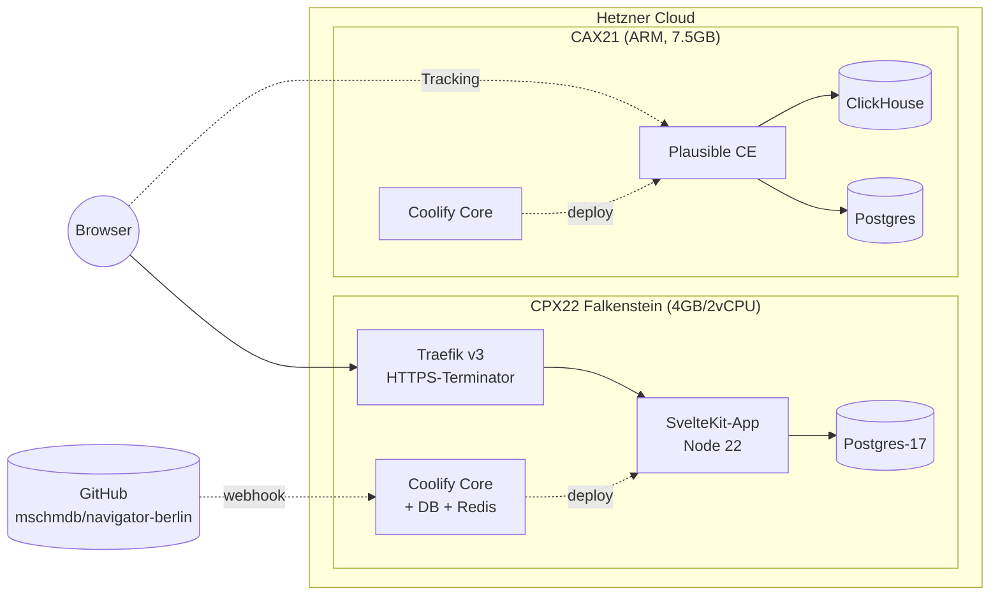
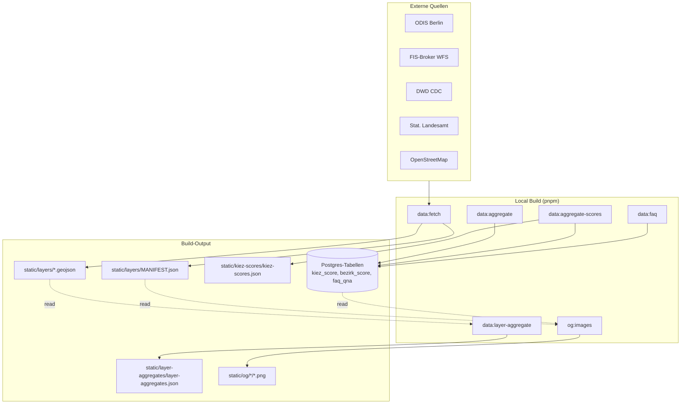

# System-Map

Service-Topology + Datenfluss + Build-Pipeline + Schedules. Mermaid-Diagramme sind LLM-parsebar + GitHub-renderbar.

## Service-Topology



**Key:**

- CPX22 = Production-Host (navigator.berlin, coolify.navigator.berlin)
- CAX21 = Aux-Host (plausible.navigator.berlin, coolify.fliege.dev, ggf. backup-target)
- Browser → Traefik → App = User-Path. Traefik macht TLS-Terminierung + Routing
- Browser → Plausible = parallel, asynchron, cookieless
- GitHub-App-Webhook triggert Coolify-Build bei Push-to-main

## Datenfluss-Pipeline (Build-Time)



**Datenfluss-Atlas pro Layer:** [docs/pipelines/data-flow.md](../pipelines/data-flow.md) (auto-generiert).

## Build-Pipeline (Deploy)

```mermaid
graph LR
  Push[git push main] --> GH[GitHub-Repo]
  GH -.webhook.-> Coolify[Coolify]
  Coolify --> Build[Docker-Build<br/>Multi-Stage]
  Build --> Prebuild[svelte-kit sync<br/>db:migrate<br/>data:aggregate*<br/>og:images]
  Prebuild --> Vite[vite build<br/>prerender]
  Vite --> Runtime[Runtime-Container<br/>node:22-alpine + tini]
  Runtime --> Health[/api/healthz check]
  Health --> Live[Container live + Traefik-Route]
```

Build-Dauer: ~5-10 min für full-build inkl. 198 OG-PNGs + Prerender aller Kiez/Bezirk-Pages.

## Cron-Schedules

| Was | Wo | Wann | Auswirkung bei Fehler |
|---|---|---|---|
| **Backup-Cron** (pg_dump + .env → CAX21) | CPX22 Cron (`/etc/cron.d/navigator-backup`) | Sun 04:00 UTC | Backup-Lücke, kein User-Impact |
| **Coolify Docker-Cleanup** | Coolify intern | täglich 00:00 (default) | unused-images bleiben länger |
| **Let's-Encrypt-Renewal** (Traefik) | Traefik intern | automatisch 30d vor Expiry | bei Failure: TLS-Fehler nach Cert-Expiry |
| **Plausible Event-Aggregation** | Plausible-Container intern | hourly + daily | Dashboard-Lücken |

Geplant (Story 5.1, deferred zu Epic 7): GitHub-Actions-Cron für Daten-Refresh pro Layer (Klima jährlich, BRW alle 2 Jahre, etc.) — aktuell nicht implementiert.

## Frontend-Routes

```mermaid
graph TB
  Root[/] -->|landing| Home[Home-Hero]
  Root --> Explore[/explore<br/>Atlas + Inspector]
  Root --> Ranking[/umwelt-infrastruktur-score<br/>301 von /wo-lebt-es-sich-gut]
  Root --> Bezirk[/bezirk/-slug-<br/>12 prerendered]
  Root --> Kiez[/kiez/-slug-<br/>143 prerendered]
  Root --> Layer[/layer/-slug-<br/>40+ prerendered]
  Root --> Methodik[/methodik]
  Root --> Updates[/updates<br/>+ RSS/Atom/JSON]
  Root --> Meta[/impressum<br/>/datenschutz<br/>/architektur<br/>/lizenzen]
  Root --> WebMCP[/.well-known/webmcp.json<br/>/webmcp-manifest.json]
  Root --> LLMs[/llms.txt<br/>/llms-full.txt]
```

## State-Slots (Production)

| State | Wo | Persistence |
|---|---|---|
| Postgres-App-Daten | CPX22 Container `u83rd482pdebahel7a1bi80n` | Docker-Volume, weekly-backup |
| Coolify-State | CPX22 `/data/coolify/*` | manual-backup via `.env`-Snapshot |
| Plausible-Events | CAX21 ClickHouse-Volume | kein Off-Server-Backup (re-aggregation aus Web-Vitals erlaubt) |
| User-LocalStorage | Browser | nicht auf Server, kein Server-Backup nötig |
| Static-Files (committed) | GitHub-Repo + Build-Output | Repo = Source-of-Truth |

## Was bewusst NICHT existiert

- Kein CDN (Tile-Cache läuft direkt auf MapTiler/OpenFreeMap)
- Keine Edge-Caching-Schicht (Single-Region-Host reicht für Phase-1-Traffic)
- Keine Multi-AZ-Replication (Cost-Reality, navigator.berlin = Non-Commercial)
- Kein Staging-Server (Local-Dev gegen lokale Postgres = staging)
- Kein Sentry / kein APM / kein Distributed-Tracing (Plausible deckt Owner-Bedarf)

## Externe Abhängigkeiten

| Service | Was passiert wenn down |
|---|---|
| OpenFreeMap (Tiles) | Karte rendert ohne Tiles (Browser-Konsole-Errors), Site-Funktionalität bleibt |
| Nominatim (Geocoding) | Adress-Suche blockt, Permalink-Direct-Load funktioniert |
| MapTiler (falls jemals als Fallback) | nicht im Production-Pfad, nur als Backup |
| Hetzner-Cloud-API | nur für Provisioning relevant, nicht für Runtime |
| INWX-DNS | bei DNS-Down: Site nicht erreichbar (TTL 300, Recovery innerhalb 5 min nach Fix) |
| GitHub-App (Coolify-Source) | Deploy-Trigger funktioniert nicht, Live-Site läuft weiter |
